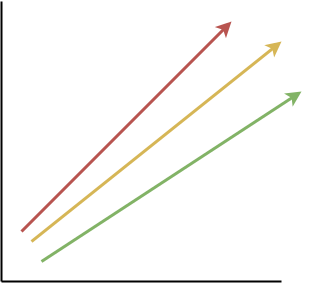

Parameter curves for Concrete
=============

This Github repository contains the code needed to generate the Parameter curves used inside Zama. The repository contains the following files:

- cpp/, Python scripts to generate a cpp file containing the parameter curves
- data/, a folder containing the data generated for previous curves. 
- estimator/, Zama's internal version of the LWE Estimator
- figs/, a folder containing various figures related to the parameter curves
- scripts.py, a copy of all scripts required to generate the parameter curves
- a variety of other python files, used for estimating the security of previous Concrete parameter sets

Example
-------------------
This is an example of how to generate the parameter curves, and save them to file.

::

    sage: load("scripts.py")
    sage: results = get_zama_curves()
    sage: save(results, "v0.sobj")
::

We can load results files, and find the interpolants.

::
[(-0.04042633119364589, 1.6609788641436722, 80, 'PASS', 450),
 (-0.03414780360867051, 2.017310258660345, 96, 'PASS', 450),
 (-0.029670137081135885, 2.162463714083856, 112, 'PASS', 450),
 (-0.02640502876522622, 2.4826422691043177, 128, 'PASS', 450),
 (-0.023821437305989134, 2.7177789440636673, 144, 'PASS', 450),
 (-0.02174358218716036, 2.938810548493322, 160, 'PASS', 498),
 (-0.019904056582117684, 2.8161252801542247, 176, 'PASS', 551),
 (-0.018610403247590085, 3.2996236848399008, 192, 'PASS', 606),
 (-0.014606812351714953, 3.8493629234693003, 256, 'PASS', 826)]
::

Finding the value of n_{alpha} is done manually. We can also verify the interpolants which are generated at the same time:

::

    # verify the interpolant used for lambda = 256 (which is interps[-1])
    sage: z = verify_interpolants(interps[-1], (128,2048), 64)
    [... code runs, can take ~10 mins ...]
    # find the index corresponding to n_alpha, which is where security drops below the target security level (256 here)
    sage: n_alpha = find_nalpha(z, 256)
    653
    
    # so the model in this case is 
    (-0.014327640360322604, 2.899270827311096, 653)
    # which corresponds to
    # sd(n) = max(-0.014327640360322604 * n +  2.899270827311096, -logq + 2), n >= 653
::

Version History
-------------------

Data for the curves are kept in /data. The following files are present:

::

    v0: generated using the {usvp, dual, decoding} attacks
    v0.1: generated using the {mitm, usvp, dual, decoding} attacks
::

TODO List
-------------------

There are several updates which are still required.
    1. Consider Hybrid attacks (WIP, Michael + Ben are coding up hybrid-dual/hybrid-decoding estimates)
    2. CI/CD stuff for new pushes to the external LWE Estimator.
    3. Fully automate the process of finding n_{alpha} for each curve.
    4. Functionality for q =! 64? This is covered by the curve, but we currently don't account for it in the models, and it needs to be done manually.
    5. cpp file generation
