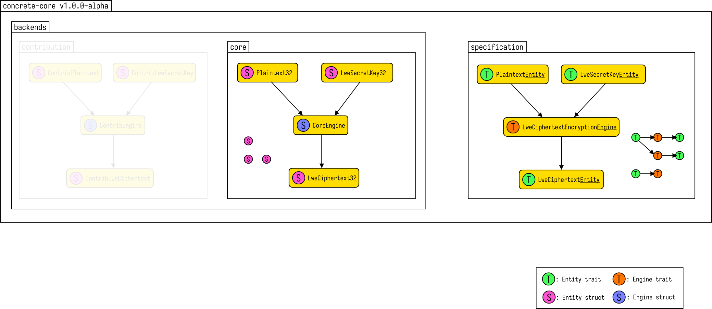

# API Structure

`concrete-core` is a modular library based on two main components:



- The [`specification`](https://docs.rs/concrete-core/1.0.0-beta/concrete_core/specification/index.html)
module contains a blueprint (in the form of Rust Traits) of the FHE scheme exposed
in `concrete-core`.

- The `backends` module contains submodules (such a submodule, we call a _backend_ in this document)
  , which implement all or a part of the specification.

Those backends may rely on different hardware resources, which may not always be available. For this
reason, it is possible to include and exclude backends from a build, by acting on the
associated `backend_*` feature flag.

## Entities and Engines

The `specification` module describes two kinds of objects which can be implemented in a backend.

All the traits appearing in the
[`specification::entities`](https://docs.rs/concrete-core/1.0.0-beta/concrete_core/specification/entities/index.html)
module represent the _datatypes_ manipulated in the library (we call _entities_ all these datatypes
we use in the library). To mention a few of them, we have:

+ [`PlaintextEntity`](https://docs.rs/concrete-core/1.0.0-beta/concrete_core/specification/entities/trait.PlaintextEntity.html)
+ [`LweSecretKeyEntity`](https://docs.rs/concrete-core/1.0.0-beta/concrete_core/specification/entities/trait.LweSecretKeyEntity.html)
+ [`LweCipertextEntity`](https://docs.rs/concrete-core/1.0.0-beta/concrete_core/specification/entities/trait.LweCiphertextEntity.html)
+ and more

Only _one_ of the `*Entity` traits can be implemented at once, by a type exported by a backend. If a
structure implements `PlaintextEntity`, it can not be `LweCiphertextEntity` at the same time, for
instance.

All the traits appearing in the
[`specification::engines`](https://docs.rs/concrete-core/1.0.0-beta/concrete_core/specification/engines/index.html)
module represent the _operators_ which can be used to manipulate entities in the library (we call _
engines_
all these operators we use in the library). For instance, we have:

+ [`LweSecretKeyCreationEngine`](https://docs.rs/concrete-core/1.0.0-beta/concrete_core/specification/engines/trait.LweSecretKeyCreationEngine.html)
+ [`LweCiphertextEncryptionEngine`](https://docs.rs/concrete-core/1.0.0-beta/concrete_core/specification/engines/trait.LweCiphertextEncryptionEngine.html)
+ [`LweCiphertextDecryptionEngine`](https://docs.rs/concrete-core/1.0.0-beta/concrete_core/specification/engines/trait.LweCiphertextDescryptionEngine.html)
+ and more

If you read between the lines, the fact that we use traits to represent operators, means that we
will have to use special object (which we call _engines_ in this document), to perform the
operations. This is slightly different from an object model in which operators are usually tied to
the data themselves. In practice, this makes sense because we tend to use _side-resources_ to
perform operations, and those are better stored in a separate structure.

Contrary to entities, there is no restrictions on how many `*Engine` traits a type can implement. In
practice, we tend to expose very few engines in a given backend.

## Example backend

Let's go through an example of a backend implementation to illustrate the concepts.

The `core` backend, contains Zama's own cpu based implementation of the scheme. It is located at
[`backends::core`](https://docs.rs/concrete-core/1.0.0-beta/concrete_core/backends/core/index.html)
. The associated feature flag is the `backend_core`, but since it is the most prominent backend for
now, we include it automatically (it is part of the `default` flag).

In this core backend, you will find the same structure as in the `specification`:

+ One [`engines`](https://docs.rs/concrete-core/1.0.0-beta/concrete_core/backends/core/engines/index.html)
module containing the engines exported by the `core` backend

+ One [`entities`](https://docs.rs/concrete-core/1.0.0-beta/concrete_core/backends/core/entities/index.html)
module containing the entities exported by the `core` backend

In the `entities` module, among other types, we find the
[`LweCiphertext64`](https://docs.rs/concrete-core/1.0.0-beta/concrete_core/backends/core/entities/struct.LweCiphertext64.html)
type. It is an _entity_, which implements the
[`LweCiphertextEntity`](https://docs.rs/concrete-core/1.0.0-beta/concrete_core/specification/entities/trait.LweCiphertextEntity.html)
trait (this type is actually listed in the implementors of the type).

In the `engines` module, we find a single type, which is
[`CoreEngine`](https://docs.rs/concrete-core/1.0.0-beta/concrete_core/backends/core/engines/struct.CoreEngine.html)
. It is an _engine_ which implements many `*Engine` traits, among which the
[`LweCiphertextEncryptionEngine`](https://docs.rs/concrete-core/1.0.0-beta/concrete_core/specification/engines/trait.LweCiphertextEncryptionEngine.html)
trait, or the
[`LweSecretKeyCreationEngine`](https://docs.rs/concrete-core/1.0.0-beta/concrete_core/specification/engines/trait.LweSecretKeyCreationEngine.html)
trait, both of which are implemented for 32 and 64 bits precisions.

## Operator semantics

As much as possible, we try to support different semantics for each operator
in `specification::engines`.

### Pure operators

They take their inputs as arguments, allocate the objects holding the results, and return them. We
call them _pure_ in the sense of pure functions, because they do not have side effects on entities (
though they may have side effects on the engine). These engine traits do not have any particular
prefixes in their names. When non-pure variants of the operator exist, the pure variant tend to
require more resources, because of the allocations it does. Example of such engine traits include:

+ [`LweCiphertextEncryptionEngine`](https://docs.rs/concrete-core/1.0.0-beta/concrete_core/specification/engines/trait.LweCiphertextEncryptionEngine.html)
+ [`LweBootstrapKeyCreationEngine`](https://docs.rs/concrete-core/1.0.0-beta/concrete_core/specification/engines/trait.LweBootstrapKeyCreationEngine.html)

### Discarding operators

They take both their inputs and outputs as arguments. In those operations, the data originally
available in the outputs is not used for the computation. We call them _discarding_ because they
discard the data which exist in the output argument and replace it with something else. The engine
traits following this semantics contain the `Discarding` word in their names. Examples of such
engines traits include:

+ [`LweCiphertextDiscardingAdditionEngine`](https://docs.rs/concrete-core/1.0.0-beta/concrete_core/specification/engines/trait.LweCiphertextDiscardingAdditionEngine.html)
+ [`LweCiphertextDiscardingKeyswitchEngine`](https://docs.rs/concrete-core/1.0.0-beta/concrete_core/specification/engines/trait.LweCiphertextDiscardingKeyswitchEngine.html)

### Fusing operators

They take both their inputs and outputs as arguments. In those operations though, the data
originally contained in the output is used for computation. We call them _fusing_, because they fuse
input arguments into the output argument, which is used in the process (as opposed to _discarded_).
The engine traits which follow this semantics contain the `Fusing` word in their names. Examples of
such engines include:

+ [`LweCiphertextFusingAdditionEngine`](https://docs.rs/concrete-core/1.0.0-beta/concrete_core/specification/engines/trait.LweCiphertextFusingAdditionEngine.html)
+ [`LweCiphertextCleartextFusingMultiplicationEngine`](https://docs.rs/concrete-core/1.0.0-beta/concrete_core/specification/engines/trait.LweCiphertextCleartextFusingMultiplicationEngine.html)

## Key distributions

Ciphertexts can be encoded using keys whose data is sampled according to different distributions:

+ Uniform binary
+ Uniform ternary
+ Gaussian

The distribution of the key used to encrypt a ciphertext has a direct impact on which algorithm can
be used on the ciphertext. For this reason, we have a mechanism to ensure, at compile time, that
algorithms gets executed on compatible entities.

This mechanism relies on associating a marker type to keys and ciphertexts. For instance, the
`LweSecretKeyEntity` has an associated `KeyDistribution` type in its definition, which represent
which sampling was used:

```rust
pub trait LweSecretKeyEntity: AbstractEntity<Kind=LweSecretKeyKind> {
    type KeyDistribution: KeyDistributionMarker;
    fn lwe_dimension(&self) -> LweDimension;
}
```

This `KeyDistribution` type must implement `KeyDistributionMarker`, which means it can be one of
three types:

+ `BinaryKeyDistribution`
+ `TernaryKeyDistribution`
+ `GaussianKeyDistribution`

Those types are empty and have no other use than representing the distribution of the key in the
type system.

The `backends::core::entities::LweSecretKey64` type implements `LweSecretKeyEntity` with
the `KeyDistribution`
type equal to `BinaryKeyDistribution` (see
[this line of the doc](https://docs.rs/concrete-core/1.0.0-beta/concrete_core/backends/core/entities/struct.LweSecretKey64.html#associatedtype.KeyDistribution))
. This means that it represents binary lwe secret keys.

Now, if we have a look at the definition of the `LweCiphertextEntity` trait:

```rust
pub trait LweCiphertextEntity: AbstractEntity<Kind=LweCiphertextKind> {
    type KeyDistribution: KeyDistributionMarker;
    fn lwe_dimension(&self) -> LweDimension;
}
```

We can see that it also contains a `KeyDistribution` associated type, which represents which kind of
key was used when encrypting the ciphertext.

The `backends::core::entities::LweCiphertext64` type implements `LweCiphertextEntity` with the
`KeyDistribution` type also equals to `BinaryKeyDistribution` (see
[this line of the doc](https://docs.rs/concrete-core/1.0.0-beta/concrete_core/backends/core/entities/struct.LweCiphertext64.html#associatedtype.KeyDistribution))
. This means that it represents an lwe ciphertext encoded with a binary key.

Most importantly, the definition of `LweCiphertextEncryptionEngine` looks like this:

```rust
pub trait LweCiphertextEncryptionEngine<SecretKey, Plaintext, Ciphertext>: AbstractEngine where
    SecretKey: LweSecretKeyEntity,
    Plaintext: PlaintextEntity,
    Ciphertext: LweCiphertextEntity<KeyDistribution=SecretKey::KeyDistribution>, {
    ...
}
```

If you focus on the trait bounds, you can see
`Ciphertext: LweCiphertextEntity<KeyDistribution = SecretKey::KeyDistribution>`. This bounds
prevents implementing `LweCiphertextEncryptionEngine` for two generic types `SecretKey`
and `Ciphertext` with incompatible key distribution.

Considering the `backends::core::engines::CoreEngine` type, it
implements `LweCiphertextEncryptionEngine` for
`SecretKey=LweSecretKey64` and `Ciphertext=LweCiphertext64` which have the same `KeyDistribution`
associated type.

## Error Management

Every `*Engine` trait is tied to a special `*Error` of the same name. For instance,
`LweCiphertextVectorFusingAdditionEngine` is tied to the `LweCiphertextVectorFusingAdditionError`
enum whose definition is:

```rust
pub enum LweCiphertextVectorFusingAdditionError<EngineError: Error> {
    LweDimensionMismatch,
    // General error case
    CiphertextCountMismatch,
    // General error case
    Engine(EngineError),     // Engine-specific error case
}
```

This error is returned by the engine, if an error occurred while performing the operation. The two
first error cases are _general_, in the sense that they can be produced by any engine implementing
`LweCiphertextVectorFusingAdditionEngine`. The last error case is a placeholder for an `EngineError`
type parameter, associated to the engine itself. This `EngineError` will be different for any
engine, and contains error cases specific to a given engine.

## Unchecked operators entry points

Every `*Engine` trait has two entry points:

+ One _safe_ entry point, which returns a `Result<SomeType, SomeError>`
+ One _unsafe_ entry point, which only returns `SomeType`, and is suffixed with `_unchecked`

For instance, here is the declaration of the `LweCiphertextEncryptionEngine`:

```rust
pub trait LweCiphertextEncryptionEngine<SecretKey, Plaintext, Ciphertext>: AbstractEngine where
    SecretKey: LweSecretKeyEntity,
    Plaintext: PlaintextEntity,
    Ciphertext: LweCiphertextEntity<KeyDistribution=SecretKey::KeyDistribution>, {
    fn encrypt_lwe_ciphertext(
        &mut self,
        key: &SecretKey,
        input: &Plaintext,
        noise: Variance
    ) -> Result<Ciphertext, LweCiphertextEncryptionError<Self::EngineError>>;
    unsafe fn encrypt_lwe_ciphertext_unchecked(
        &mut self,
        key: &SecretKey,
        input: &Plaintext,
        noise: Variance
    ) -> Ciphertext;
}
```

Both of them perform the same operation, but the safe entry points will check that all the
preconditions on which the operator rely are verified, and return a descriptive error if this is not
the case.

We chose to mark the unchecked entry point with the `unsafe` keyword, to bring the attention of the
users on the operator documentation. If you want to use those, you have to take it on you to ensure
that the documented preconditions hold before calling the operator.

## Memory Management

At the opposite of what is done in the rest of the Rust world, the `concrete-core` api relies on _
manual_
memory management. Allocation is usually done with pure entry points, like in the case of
`LweCiphertextEncryptionEngine`, which returns a fresh `LweCiphertextEntity`. For deallocation, the
engines which allocates entities should provide an implementation of the
[`DestructionEngine`](https://docs.rs/concrete-core/1.0.0-beta/concrete_core/specification/engines/trait.DestructionEngine.html)
trait to deallocate the entity.

This choice is very unconventional in Rust, but it has its reasons. The first reason is that some
backends are expected to rely on external devices such as GPU or FPGA. Those resources may have
their own memory, separated from the CPU memory, and hence, the rust global allocator will not be
able to manage it. For this reason, in the case of engines relying on external devices, the simplest
thing to do is to turn the engine into an allocator, and let the user deal with it. Another reason
is that `concrete-core` was designed to be exposed to other languages through different bindings,
among which a C binding. It is simpler to develop this C binding if destruction is already a first
class citizen of the API.
