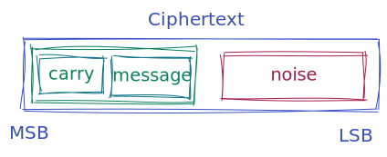

# How Shortint are represented

In `concrete-shortint`, the encrypted data is stored in an LWE ciphertext.

Conceptually, the message stored in an LWE ciphertext, is divided into 
a **carry buffer** and a **message buffer**.

The message buffer is the space where the actual message is 
stored. This represents the modulus of the input messages 
(denoted by `MessageModulus` in the code) 
When doing computations on a ciphertext, the encrypted message can overflow the message 
modulus: the exceeding information is stored in 
the carry buffer. The size of the carry buffer is defined by another modulus, called 
`CarryModulus`.

Together, the message modulus and the carry modulus form the plaintext space that is
available in a ciphertext. This space cannot be overflowed, otherwise the computation may result 
in incorrect outputs. 

In order to ensure the computation correctness, we keep track of the maximum value encrypted in a 
ciphertext
via an associated attribute called the **degree**. When the degree reaches a defined 
threshold, the carry buffer may be emptied to resume safely the computations. 
Therefore, in `concrete-shortint` the carry modulus is mainly considered as a means to do more 
computations.

# Types of operations

The operations available via a `ServerKey` may come in different variants:

  - operations that take their inputs as encrypted values.
  - scalar operations take at least one non-encrypted value as input.

For example, the addition has both variants:

  - `ServerKey::unchecked_add` which takes two encrypted values and adds them.
  - `ServerKey::unchecked_scalar_add` which takes an encrypted value and a clear value (the 
     so-called scalar) and adds them.

Each operation may come in different 'flavors':

  - `unchecked`: Always does the operation, without checking if the result may exceed the capacity of 
     the plaintext space.
  - `checked`: Checks are done before computing the operation, returning an error if operation 
      cannot be done safely.
  - `smart`: Always does the operation, if the operation cannot be computed safely, the smart operation
             will clear the carry modulus to make the operation possible.

Not all operations have these 3 flavors, as some of them are implemented in a way that the operation
is always possible without ever exceeding the plaintext's space capacity.
