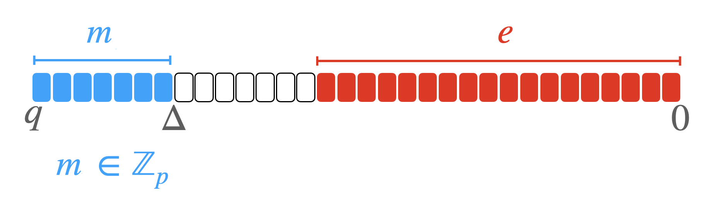
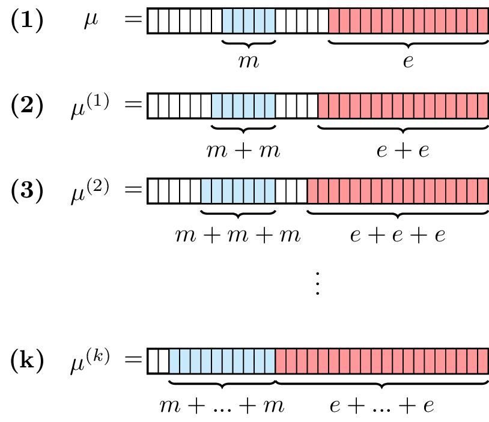

# Security and Cryptography

## Integer representation

Concrete 0.2.0 proposes predefined types to represent the encryption of unsigned integers, called `FheUint`. In the case where input message size is small enough, the message is simply encrypted with one ciphertext.&#x20;

By means of example, the type `FheUint3`, which is used to represent messages encoded over 3 bits, will contain only one ciphertext. When the input message size is larger, many ciphertexts are used. The idea is to split the input message following a **radix decomposition**, whose decomposition basis is dependent on the chosen parameter set.

For instance, in the type `FheUint12`, now representing messages encoded over 12 bits, 6 ciphertexts are involved. Each one of them contains the encryption of messages encoded over 2 bits. Before being encrypted, the message $$m$$ over 12 bits is split into 6 smaller messages $$m_i, i\in [0,5]$$ over 2 bits such that $$m = \sum_{i = 0}^{5}m_i \times 2^ {i}$$. In other words, the message is first decomposed over the basis $$2^2$$ (for 2 bits), and then each piece is separately encrypted.

## Security

By default, the cryptographic parameters provided by Concrete 0.2.0 ensure at least 128 bits of security. The security has been evaluated using the latest versions of the Lattice Estimator ([repository](https://github.com/malb/lattice-estimator)) with `red_cost_model = reduction.RC.BDGL16`.

For all sets of parameters, the error probability when computing a univariate function over one ciphertext is $$2^{-13.9}$$. Note that univariate functions might be performed when arithmetic functions are computed (for instance, the multiplication of two ciphertexts).

---

# TFHE

Concrete is an FHE library based on TFHE.

It is interesting to understand some basics about TFHE,
in order to apprehend where the limitations are coming from both
in terms of precision (number of bits used to represent the plaintext values)
and execution time (why TFHE operations are slower than native operations).

# LWE Ciphertexts

Although there are many kinds of ciphertexts in TFHE,
all the encrypted values in concrete are mainly stored as LWE ciphertexts.

The security of TFHE relies on LWE which stands for Learning With Errors.
The problem is believed to be secure against quantum attacks.

An LWE Ciphertext is a collection of 32-bits or 64-bits unsigned integers.
Before encrypting a message in an LWE ciphertext, one needs to first encode it as a plaintext.
This is done by shifting the message to the most significant bits of the unsigned integer type used.

Then, a little random value called noise is added to the least significant bits.
This noise (also called error for Learning With Errors) is crucial to the security of the ciphertext.

$$ plaintext = (\Delta * m) + e $$

To go from a **plaintext** to a **ciphertext** one needs to encrypt the plaintext using a secret key.

An LWE secret key is a list of `n` random integers: $$S = (s_0, ..., s_n)$$.
$$n$$ is called the $$LweDimension$$

A LWE ciphertext, is composed of two parts:
- The mask $$(a_0, ..., a_{n-1})$$
- The body $$b$$

The mask of a _fresh_ ciphertext (one that is the result of an encryption 
and not an operation such as ciphertext addition) is a list of `n` uniformly random values.

The body is computed as follows:

$$ b = (\sum_{i = 0}^{n-1}{a_i * s_i}) + plaintext $$

Now that the encryption scheme is defined, to illustrate why it is slower to compute over encrypted data,
let us show the example of the addition between ciphertexts.

To add two ciphertexts, we must add their $mask$ and $body$ as done below.

$$
ct_0 = (a_{0}, ..., a_{n}, b) \\
ct_1 = (a_{1}^{'}, ..., a_{n}^{'}, b^{'}) \\

ct_{2} = ct_0 + ct_1 \\
ct_{2} = (a_{0} + a_{0}^{'}, ..., a_{n} + a_{n}^{'}, b + b^{'})\\

b + b^{'} = (\sum_{i = 0}^{n-1}{a_i * s_i}) + plaintext + (\sum_{i = 0}^{n-1}{a_i^{'} * s_i}) + plaintext^{'}\\

b + b^{'} = (\sum_{i = 0}^{n-1}{(a_i + a_i^{'})* s_i}) + \Delta m + \Delta m^{'} + e + e^{'}\\
$$

To add ciphertexts, it is sufficient to add their masks and bodies. 
Instead of just adding 2 integers, one needs to add $$n + 1$$ elements.
The addition is an intuitive example to show the slowdown of FHE computation compared to plaintext
computation but other operations are far more expensive
(e.g. the computation of a lookup table using the Programmable Bootstrapping)

# Ciphertexts Operations

## Understanding noise and padding

In FHE, there are two types of operations that can be applied to ciphertexts:

* **leveled operations**, which increase the noise in the ciphertext
* **bootstrapped operations**, which reduce the noise in the ciphertext

In FHE, the noise must be tracked and managed in order to guarantee the correctness of the computation.

Bootstrapping operations are used across the computation to decrease the noise in the ciphertexts,
preventing it from tampering the message.
The rest of the operations are called leveled because they do not need bootstrapping operations 
and thus are most of the time really fast.

The following sections explain the concept of noise and padding in ciphertexts,
which are core to how Concrete enables efficient homomorphic operations.

### Noise

For it to be secure, LWE requires random noise to be added to the message at encryption time. 

In TFHE, this random noise is drawn from a Centered Normal Distribution parameterized by a standard deviation. This standard deviation is a
security parameter. 
With all other security parameters set, the larger the standard deviation is,
the more secure the encryption is.

In Concrete, the noise is encoded in the least significant bits of the plaintexts. 
Each leveled computation will increase the noise, and thus if too many computations are done,
the noise will eventually overflow onto the significant data bits of the message and lead to an incorrect result.

The figure below illustrates this problem in case of an addition, where an extra bit of noise is incurred as a result.

Concrete manages the noise for you, by performing bootstrapping operations to reset the noise when needed.

### Padding

Since encoded values have a fixed precision, operating on them can sometime produce results that are outside the original interval.
To avoid losing precision or wrapping around the interval, Concrete uses the additional bits by defining bits of **padding** on the most significant bits.

As an example, consider adding two ciphertexts.
Adding two values could en up outside the range of either ciphertexts, and thus necessitate a carry, which would then be carried onto the first padding bit.
In the figure below, each plaintext over 32 bits has one bit of padding on its left \(i.e., the most significant bit\). 
After the addition, the padding bit is no longer available, as it has been used in order for the carry. This is referred to as **consuming** bits of padding. 
Since no padding is left, there is no guarantee that additional additions would yield correct results.

Concrete manages this for you.

If you would like to know more about TFHE, you can find more information in our
[TFHE Deep Dive](https://www.zama.ai/post/tfhe-deep-dive-part-1).
