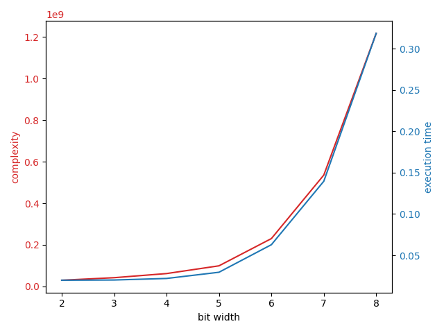

# Performance tips

## Improve parallelism

Modern CPUs have multiple cores to perform computation and utilizing multiple cores is a great way to boost performance.

There are two kinds of parallelism in Concrete:
- Loop parallelism to make tensor operations parallel, achieved by using [OpenMP](https://www.openmp.org/)
- Dataflow parallelism to make independent operations parallel, achieved by using [HPX](https://hpx.stellar-group.org/)

Loop parallelism is enabled by default, as it's supported on all platforms. Dataflow parallelism however is only supported on Linux, hence not enabled by default.

Here are some ways to improve parallelism.

### By enabling dataflow parallelism

Dataflow parallelism is a great feature, especially when the circuit is doing a lot of scalar operations.

Without dataflow parallelism, circuit is executed operation by operation, like an imperative language. If the operations themselves are not tensorized, loop parallelism would not be utilized and the entire execution would happen in a single thread. Dataflow parallelism changes this by analyzing the operations and their dependencies within the circuit to determine what can be done in parallel and what cannot. Then it distributes the tasks that can be done in parallel to different threads.

For example:

```python
import time

import numpy as np
from concrete import fhe

def f(x, y, z):
    # normally, you'd use fhe.array to construct a concrete tensor
    # but for this example, we just create a simple numpy array
    # so the matrix multiplication can happen on a cellular level
    a = np.array([[x, y], [z, 2]])
    b = np.array([[1, x], [z, y]])
    return fhe.array(a @ b)

inputset = fhe.inputset(fhe.uint3, fhe.uint3, fhe.uint3)

for dataflow_parallelize in [False, True]:
    compiler = fhe.Compiler(f, {"x": "encrypted", "y": "encrypted", "z": "encrypted"})
    circuit = compiler.compile(inputset, dataflow_parallelize=dataflow_parallelize)

    circuit.keygen()
    for sample in inputset[:3]:  # warmup
        circuit.encrypt_run_decrypt(*sample)

    timings = []
    for sample in inputset[3:13]:
        start = time.time()
        result = circuit.encrypt_run_decrypt(*sample)
        end = time.time()

        assert np.array_equal(result, f(*sample))
        timings.append(end - start)

    if not dataflow_parallelize:
        print(f"without dataflow parallelize -> {np.mean(timings):.03f}s")
    else:
        print(f"   with dataflow parallelize -> {np.mean(timings):.03f}s")
```

prints:

```
without dataflow parallelize -> 0.609s
   with dataflow parallelize -> 0.414s
```

and the reason for that is:

```
// this is the generated MLIR for the circuit
// without dataflow, every single line would be executed one after the other

module {
  func.func @main(%arg0: !FHE.eint<7>, %arg1: !FHE.eint<7>, %arg2: !FHE.eint<7>) -> tensor<2x2x!FHE.eint<7>> {
  
    // but if you look closely, you can see that this multiplication
    %c1_i2 = arith.constant 1 : i2
    %0 = "FHE.mul_eint_int"(%arg0, %c1_i2) : (!FHE.eint<7>, i2) -> !FHE.eint<7>
    
    // is completely independent of this one, so dataflow makes them run in parallel
    %1 = "FHE.mul_eint"(%arg1, %arg2) : (!FHE.eint<7>, !FHE.eint<7>) -> !FHE.eint<7>
    
    // however, this addition needs the first two operations
    // so dataflow waits until both are done before performing this one
    %2 = "FHE.add_eint"(%0, %1) : (!FHE.eint<7>, !FHE.eint<7>) -> !FHE.eint<7>
    
    // lastly, this multiplication is completely independent from the first three operations
    // so its execution starts in parallel when execution starts with dataflow
    %3 = "FHE.mul_eint"(%arg0, %arg0) : (!FHE.eint<7>, !FHE.eint<7>) -> !FHE.eint<7>
    
    // similar logic can be applied to the remaining operations...
    %4 = "FHE.mul_eint"(%arg1, %arg1) : (!FHE.eint<7>, !FHE.eint<7>) -> !FHE.eint<7>
    %5 = "FHE.add_eint"(%3, %4) : (!FHE.eint<7>, !FHE.eint<7>) -> !FHE.eint<7>
    %6 = "FHE.mul_eint_int"(%arg2, %c1_i2) : (!FHE.eint<7>, i2) -> !FHE.eint<7>
    %c2_i3 = arith.constant 2 : i3
    %7 = "FHE.mul_eint_int"(%arg2, %c2_i3) : (!FHE.eint<7>, i3) -> !FHE.eint<7>
    %8 = "FHE.add_eint"(%6, %7) : (!FHE.eint<7>, !FHE.eint<7>) -> !FHE.eint<7>
    %9 = "FHE.mul_eint"(%arg2, %arg0) : (!FHE.eint<7>, !FHE.eint<7>) -> !FHE.eint<7>
    %10 = "FHE.mul_eint_int"(%arg1, %c2_i3) : (!FHE.eint<7>, i3) -> !FHE.eint<7>
    %11 = "FHE.add_eint"(%9, %10) : (!FHE.eint<7>, !FHE.eint<7>) -> !FHE.eint<7>
    %from_elements = tensor.from_elements %2, %5, %8, %11 : tensor<2x2x!FHE.eint<7>>
    return %from_elements : tensor<2x2x!FHE.eint<7>>
    
  }
}
```

To summarize, dataflow analyzes the circuit to determine which parts of the circuit can be run at the same time, and tries to run as many operations as possible in parallel.


When the circuit is tensorized, dataflow might slow execution down since the tensor operations already use multiple threads and adding dataflow on top creates congestion in the CPU between the HPX (dataflow parallelism runtime) and OpenMP (loop parallelism runtime). So try both before deciding on whether to use dataflow or not.


### By tensorizing operations

Tensors should be used instead of scalars when possible to maximize loop parallelism.

For example:

```python
import time

import numpy as np
from concrete import fhe

inputset = fhe.inputset(fhe.uint6, fhe.uint6, fhe.uint6)
for tensorize in [False, True]:
    def f(x, y, z):
        return (
            np.sum(fhe.array([x, y, z]) ** 2)
            if tensorize
            else (x ** 2) + (y ** 2) + (z ** 2)
        )

    compiler = fhe.Compiler(f, {"x": "encrypted", "y": "encrypted", "z": "encrypted"})
    circuit = compiler.compile(inputset)

    circuit.keygen()
    for sample in inputset[:3]:  # warmup
        circuit.encrypt_run_decrypt(*sample)

    timings = []
    for sample in inputset[3:13]:
        start = time.time()
        result = circuit.encrypt_run_decrypt(*sample)
        end = time.time()

        assert np.array_equal(result, f(*sample))
        timings.append(end - start)

    if not tensorize:
        print(f"without tensorization -> {np.mean(timings):.03f}s")
    else:
        print(f"   with tensorization -> {np.mean(timings):.03f}s")
```

prints:

```
without tensorization -> 0.214s
   with tensorization -> 0.118s
```


Enabling dataflow is kind of letting the runtime do this for you. It'd also help in the specific case.


## Optimize table lookups

The most costly operation in Concrete is the table lookup operation, so one of the primary goals of optimizing performance is to reduce the amount of table lookups.

Furthermore, the bit width of the input of the table lookup plays a major role in performance.

```python
import time

import numpy as np
import matplotlib.pyplot as plt
from concrete import fhe

def f(x):
    return x // 2

bit_widths = list(range(2, 9))
complexities = []
timings = []

for bit_width in bit_widths:
    inputset = fhe.inputset(lambda _: np.random.randint(0, 2 ** bit_width))

    compiler = fhe.Compiler(f, {"x": "encrypted"})
    circuit = compiler.compile(inputset)

    circuit.keygen()
    for sample in inputset[:3]:  # warmup
        circuit.encrypt_run_decrypt(*sample)

    current_timings = []
    for sample in inputset[3:13]:
        start = time.time()
        result = circuit.encrypt_run_decrypt(*sample)
        end = time.time()

        assert np.array_equal(result, f(*sample))
        current_timings.append(end - start)

    complexities.append(int(circuit.complexity))
    timings.append(float(np.mean(current_timings)))

    print(f"{bit_width} bits -> {complexities[-1]:>13_} complexity -> {timings[-1]:.06f}s")

figure, complexity_axis = plt.subplots()

color = "tab:red"
complexity_axis.set_xlabel("bit width")
complexity_axis.set_ylabel("complexity", color=color)
complexity_axis.plot(bit_widths, complexities, color=color)
complexity_axis.tick_params(axis="y", labelcolor=color)

timing_axis = complexity_axis.twinx()

color = 'tab:blue'
timing_axis.set_ylabel('execution time', color=color)
timing_axis.plot(bit_widths, timings, color=color)
timing_axis.tick_params(axis='y', labelcolor=color)

figure.tight_layout()
plt.show()
```

The code above prints:
```
2 bits ->    29_944_416 complexity -> 0.019826s
3 bits ->    42_154_798 complexity -> 0.020093s
4 bits ->    61_979_934 complexity -> 0.021961s
5 bits ->    99_198_195 complexity -> 0.029475s
6 bits ->   230_210_706 complexity -> 0.062841s
7 bits ->   535_706_740 complexity -> 0.139669s
8 bits -> 1_217_510_420 complexity -> 0.318838s
```

And displays:


Here are some ways to optimize table lookups.

### By reducing the amount of table lookups

This one is probably the most complicated one in this list as it's not automated. The idea is to use mathematical properties of operations to reduce the amount of table lookups needed to achieve the result.

One great example is in adding big integers in bitmap representation. Here is the basic implementation:

```python
def add_bitmaps(x, y):
    result = fhe.zeros((N,))
    carry = 0

    addition = x + y
    for i in range(N):
        addition_and_carry = addition[i] + carry
        carry = addition_and_carry >> 1
        result[i] = addition_and_carry % 2

    return result
```

There are two table lookups within the loop body, one for `>>` and one for `%`.

This implementation is not optimal though, since the same output can be achieved with just a single table lookup:

```python
def add_bitmaps(x, y):
    result = fhe.zeros((N,))
    carry = 0

    addition = x + y
    for i in range(N):
        addition_and_carry = addition[i] + carry
        carry = addition_and_carry >> 1
        result[i] = addition_and_carry - (carry * 2)

    return result
```

It was possible to do this because the original operations had a mathematical equivalence with the optimized operations and optimized operations achieved the same output with less table lookups!

Here is the full code example and some numbers for this optimization:

```python
import numpy as np
from concrete import fhe

N = 32

def add_bitmaps_naive(x, y):
    result = fhe.zeros((N,))
    carry = 0

    addition = x + y
    for i in range(N):
        addition_and_carry = addition[i] + carry
        carry = addition_and_carry >= 2
        result[i] = addition_and_carry % 2

    return result

def add_bitmaps_optimized(x, y):
    result = fhe.zeros((N,))
    carry = 0

    addition = x + y
    for i in range(N):
        addition_and_carry = addition[i] + carry
        carry = addition_and_carry >> 1
        result[i] = addition_and_carry - (carry * 2)

    return result

inputset = fhe.inputset(fhe.tensor[fhe.uint1, N], fhe.tensor[fhe.uint1, N])
for (name, implementation) in [("naive", add_bitmaps_naive), ("optimized", add_bitmaps_optimized)]:
    compiler = fhe.Compiler(implementation, {"x": "encrypted", "y": "encrypted"})
    circuit = compiler.compile(inputset)

    print(
        f"{name:>9} implementation "
        f"-> {int(circuit.programmable_bootstrap_count)} table lookups "
        f"-> {int(circuit.complexity):_} complexity"
    )
```

prints:

```
    naive implementation -> 63 table lookups -> 2_427_170_697 complexity
optimized implementation -> 32 table lookups -> 1_224_206_208 complexity
```

which is almost half the amount of table lookups and ~2x less complexity for the same operation!

### By changing the implementation strategy of complex operations

Concrete provides multiple implementation strategies for these complex operations:

- [comparisons (<,<=,==,!=,>=,>)](../core-features/comparisons.md)
- [bitwise operations (<<,&,|,^,>>)](../core-features/bitwise.md)
- [minimum and maximum operations](../core-features/minmax.md)
- [multivariate extension](../core-features/extensions.md#fhemultivariatefunction)


The default strategy is the one that doesn't increase the input bit width, even if it's less optimal than the others. If you don't care about the input bit widths (e.g., if the inputs are only used in this operation), you should definitely change the default strategy.


Choosing the correct strategy can lead to big speedups. So if you are not sure which one to use, you can compile with different strategies and compare the complexity.

For example, the following code:

```python
import numpy as np
from concrete import fhe

def f(x, y):
    return x & y

inputset = fhe.inputset(fhe.uint3, fhe.uint4)
strategies = [
    fhe.BitwiseStrategy.ONE_TLU_PROMOTED,
    fhe.BitwiseStrategy.THREE_TLU_CASTED,
    fhe.BitwiseStrategy.TWO_TLU_BIGGER_PROMOTED_SMALLER_CASTED,
    fhe.BitwiseStrategy.TWO_TLU_BIGGER_CASTED_SMALLER_PROMOTED,
    fhe.BitwiseStrategy.CHUNKED,
]

for strategy in strategies:
    compiler = fhe.Compiler(f, {"x": "encrypted", "y": "encrypted"})
    circuit = compiler.compile(inputset, bitwise_strategy_preference=strategy)
    print(
        f"{strategy:>55} "
        f"-> {circuit.programmable_bootstrap_count:>2} TLUs "
        f"-> {int(circuit.complexity):>12_} complexity"
    )
```

prints:

```
                       BitwiseStrategy.ONE_TLU_PROMOTED ->  1 TLUs ->  535_706_740 complexity
                       BitwiseStrategy.THREE_TLU_CASTED ->  3 TLUs ->  599_489_229 complexity
 BitwiseStrategy.TWO_TLU_BIGGER_PROMOTED_SMALLER_CASTED ->  2 TLUs ->  522_239_955 complexity
 BitwiseStrategy.TWO_TLU_BIGGER_CASTED_SMALLER_PROMOTED ->  2 TLUs ->  519_246_216 complexity
                                BitwiseStrategy.CHUNKED ->  6 TLUs ->  358_905_521 complexity
```

or:

```python
import numpy as np
from concrete import fhe

def f(x, y):
    return x == y

inputset = fhe.inputset(fhe.uint4, fhe.uint7)
strategies = [
    fhe.ComparisonStrategy.ONE_TLU_PROMOTED,
    fhe.ComparisonStrategy.THREE_TLU_CASTED,
    fhe.ComparisonStrategy.TWO_TLU_BIGGER_PROMOTED_SMALLER_CASTED,
    fhe.ComparisonStrategy.TWO_TLU_BIGGER_CASTED_SMALLER_PROMOTED,
    fhe.ComparisonStrategy.THREE_TLU_BIGGER_CLIPPED_SMALLER_CASTED,
    fhe.ComparisonStrategy.TWO_TLU_BIGGER_CLIPPED_SMALLER_PROMOTED,
    fhe.ComparisonStrategy.CHUNKED,
]

for strategy in strategies:
    compiler = fhe.Compiler(f, {"x": "encrypted", "y": "encrypted"})
    circuit = compiler.compile(inputset, comparison_strategy_preference=strategy)
    print(
        f"{strategy:>58} "
        f"-> {circuit.programmable_bootstrap_count:>2} TLUs "
        f"-> {int(circuit.complexity):>13_} complexity"
    )
```

prints:

```
                       ComparisonStrategy.ONE_TLU_PROMOTED ->  1 TLUs -> 1_217_510_420 complexity
                       ComparisonStrategy.THREE_TLU_CASTED ->  3 TLUs ->   751_172_128 complexity
 ComparisonStrategy.TWO_TLU_BIGGER_PROMOTED_SMALLER_CASTED ->  2 TLUs -> 1_043_702_103 complexity
 ComparisonStrategy.TWO_TLU_BIGGER_CASTED_SMALLER_PROMOTED ->  2 TLUs -> 1_898_305_707 complexity
ComparisonStrategy.THREE_TLU_BIGGER_CLIPPED_SMALLER_CASTED ->  3 TLUs ->   751_172_128 complexity
ComparisonStrategy.TWO_TLU_BIGGER_CLIPPED_SMALLER_PROMOTED ->  2 TLUs ->   682_694_770 complexity
                                ComparisonStrategy.CHUNKED ->  3 TLUs ->   751_172_128 complexity
```

As you can see, strategies can affect the performance a lot! So make sure to select the appropriate one for your use case if you want to optimize performance.

### By using round/truncate bit pattern before table lookups

There are two extensions which can reduce the bit width of the table lookup input, [fhe.round_bit_pattern(...)](../core-features/rounding.md) and [fhe.truncate_bit_pattern(...)](../core-features/truncating.md), which can improve performance by sacrificing exactness.

For example the following code:

```python
import numpy as np
from concrete import fhe

inputset = fhe.inputset(fhe.uint10)
for lsbs_to_remove in range(0, 10):
    def f(x):
        return fhe.round_bit_pattern(x, lsbs_to_remove) // 2

    compiler = fhe.Compiler(f, {"x": "encrypted"})
    circuit = compiler.compile(inputset)

    print(f"{lsbs_to_remove=} -> {int(circuit.complexity):>13_} complexity")
```

prints:

```
lsbs_to_remove=0 -> 9_134_406_574 complexity
lsbs_to_remove=1 -> 3_209_430_092 complexity
lsbs_to_remove=2 -> 1_536_476_735 complexity
lsbs_to_remove=3 -> 1_588_749_586 complexity
lsbs_to_remove=4 ->   848_133_081 complexity
lsbs_to_remove=5 ->   525_987_801 complexity
lsbs_to_remove=6 ->   358_276_023 complexity
lsbs_to_remove=7 ->   373_311_341 complexity
lsbs_to_remove=8 ->   400_596_351 complexity
lsbs_to_remove=9 ->   438_681_996 complexity
```

### By activating approximate mode for rounding

You can enable [approximate mode](../core-features/rounding.md#exactness) to gain even more performance by sacrificing some more exactness:

```python
import numpy as np
from concrete import fhe

inputset = fhe.inputset(fhe.uint10)
for lsbs_to_remove in range(0, 10):
    def f(x):
        return fhe.round_bit_pattern(x, lsbs_to_remove, exactness=fhe.Exactness.APPROXIMATE) // 2

    compiler = fhe.Compiler(f, {"x": "encrypted"})
    circuit = compiler.compile(inputset)

    print(f"{lsbs_to_remove=} -> {int(circuit.complexity):>13_} complexity")

```

prints:

```
lsbs_to_remove=0 -> 9_134_406_574 complexity
lsbs_to_remove=1 -> 5_548_275_712 complexity
lsbs_to_remove=2 -> 2_430_793_927 complexity
lsbs_to_remove=3 -> 1_058_638_119 complexity
lsbs_to_remove=4 ->   409_952_712 complexity
lsbs_to_remove=5 ->   172_138_947 complexity
lsbs_to_remove=6 ->    99_198_195 complexity
lsbs_to_remove=7 ->    71_644_380 complexity
lsbs_to_remove=8 ->    55_860_516 complexity
lsbs_to_remove=9 ->    50_978_148 complexity
```

### By utilizing bit extraction

[Bit extraction](../core-features/bit_extraction.md) is a cheap way to extract certain bits of encrypted values. In can be very useful for improving the performance of circuits.

For example:

```python
import numpy as np
from concrete import fhe

inputset = fhe.inputset(fhe.uint6)
for bit_extraction in [False, True]:
    def is_even(x):
        return (
            x % 2 == 0
            if not bit_extraction
            else 1 - fhe.bits(x)[0]
        )

    compiler = fhe.Compiler(is_even, {"x": "encrypted"})
    circuit = compiler.compile(inputset)

    if not bit_extraction:
        print(f"without bit extraction -> {int(circuit.complexity):>11_} complexity")
    else:
        print(f"   with bit extraction -> {int(circuit.complexity):>11_} complexity")
```

prints:

```
without bit extraction -> 230_210_706 complexity
   with bit extraction ->  29_506_014 complexity
```

That's almost 8x improvement to circuit complexity!

## Tweak cryptographic parameters

This one is related to optimizing table lookups, but it deserves its own section. The idea is obtain more optimal cryptographic parameters (especially for table lookups) without changing the operations within the circuit.

Here are some ways to tweak cryptographic parameters.

### By adjusting table lookup error probability

This one is discussed extensively in [Table lookup exactness](../core-features/table_lookups_advanced.md#table-lookup-exactness) section. The idea is to sacrifice exactness to gain performance.

For example:

```python
import numpy as np
from concrete import fhe

def f(x, y):
    return (x // 2) * (y // 3)

inputset = fhe.inputset(fhe.uint4, fhe.uint4)
for p_error in [(1 / 1_000_000), (1 / 100_000), (1 / 10_000), (1 / 1_000), (1 / 100)]:
    compiler = fhe.Compiler(f, {"x": "encrypted", "y": "encrypted"})
    circuit = compiler.compile(inputset, p_error=p_error)
    print(f"p_error of {p_error:.6f} -> {int(circuit.complexity):_} complexity")
```

prints:

```
p_error of 0.000001 -> 294_773_524 complexity
p_error of 0.000010 -> 286_577_520 complexity
p_error of 0.000100 -> 275_887_080 complexity
p_error of 0.001000 -> 265_196_640 complexity
p_error of 0.010000 -> 184_144_972 complexity
```

### By specifying composition when using modules

When using [modules](../compilation/composing_functions_with_modules.md) make sure to specify [composition](../compilation/composing_functions_with_modules.md#optimizing-runtimes-with-composition-policies) so that the compiler can select more optimal parameters based on how the functions in the module would be used.

For example:

```python
import numpy as np
from concrete import fhe


@fhe.module()
class PowerWithoutComposition:
    @fhe.function({"x": "encrypted"})
    def square(x):
        return x ** 2

    @fhe.function({"x": "encrypted"})
    def cube(x):
        return x ** 3

without_composition = PowerWithoutComposition.compile(
    {
        "square": fhe.inputset(fhe.uint2),
        "cube": fhe.inputset(fhe.uint4),
    }
)
print(f"without composition -> {int(without_composition.complexity):>10_} complexity")


@fhe.module()
class PowerWithComposition:
    @fhe.function({"x": "encrypted"})
    def square(x):
        return x ** 2

    @fhe.function({"x": "encrypted"})
    def cube(x):
        return x ** 3

    composition = fhe.Wired(
        [
            fhe.Wire(fhe.Output(square, 0), fhe.Input(cube, 0))
        ]
    )

with_composition = PowerWithComposition.compile(
    {
        "square": fhe.inputset(fhe.uint2),
        "cube": fhe.inputset(fhe.uint4),
    }
)
print(f"   with composition -> {int(with_composition.complexity):>10_} complexity")
```

prints:

```
without composition -> 185_863_835 complexity
   with composition -> 135_871_612 complexity
```

which means specifying composition resulted in ~35% improvement to complexity for computing `cube(square(x))`.
