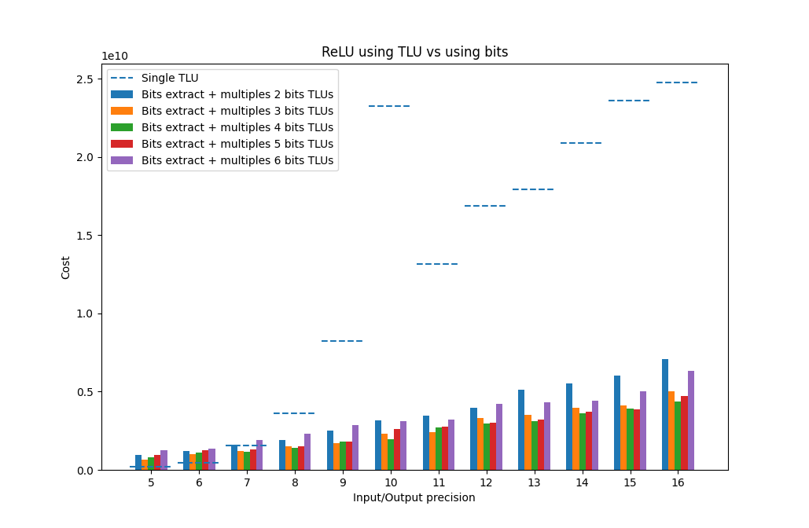

# Extensions

**Concrete** supports native Python and NumPy operations as much as possible, but not everything in Python or NumPy is available. Therefore, we provide some extensions ourselves to improve your experience.

## fhe.univariate(function)

Allows you to wrap any univariate function into a single table lookup:

```python
import numpy as np
from concrete import fhe

def complex_univariate_function(x):

    def per_element(element):
        result = 0
        for i in range(element):
            result += i
        return result

    return np.vectorize(per_element)(x)

@fhe.compiler({"x": "encrypted"})
def f(x):
    return fhe.univariate(complex_univariate_function)(x)

inputset = [np.random.randint(0, 5, size=(3, 2)) for _ in range(10)]
circuit = f.compile(inputset)

sample = np.array([
    [0, 4],
    [2, 1],
    [3, 0],
])
assert np.array_equal(circuit.encrypt_run_decrypt(sample), complex_univariate_function(sample))
```


The wrapped function:

* shouldn't have any side effects (e.g., no modification of global state)
* should be deterministic (e.g., no random numbers)
* should have the same output shape as its input (i.e., `output.shape` should be the same with `input.shape`)
* each output element should correspond to a single input element (e.g., `output[0]` should only depend on `input[0]`)

If any of these constraints are violated, the outcome is undefined.


## fhe.multivariate(function)

Allows you to wrap any multivariate function into a table lookup:

```python
import numpy as np
from concrete import fhe

def value_if_condition_else_zero(value, condition):
    return value if condition else np.zeros_like(value, dtype=np.int64)

def function(x, y):
    return fhe.multivariate(value_if_condition_else_zero)(x, y)

inputset = [
    (
        np.random.randint(-2**4, 2**4, size=(2, 2)),
        np.random.randint(0, 2**1, size=()),
    )
    for _ in range(100)
]

compiler = fhe.Compiler(function, {"x": "encrypted", "y": "encrypted"})
circuit = compiler.compile(inputset)

sample = [np.array([[-2, 4], [0, 1]]), 0]
assert np.array_equal(circuit.encrypt_run_decrypt(*sample), function(*sample))

sample = [np.array([[3, -1], [2, 4]]), 1]
assert np.array_equal(circuit.encrypt_run_decrypt(*sample), function(*sample))
```


The wrapped function:

* shouldn't have any side effects (e.g., no modification of global state)
* should be deterministic (e.g., no random numbers)
* should have input shapes which are broadcastable to the output shape (i.e., `input.shape` should be broadcastable to `output.shape` for all inputs)
* each output element should correspond to a single input element (e.g., `output[0]` should only depend on `input[0]` of all inputs)

If any of these constraints are violated, the outcome is undefined.



Multivariate functions cannot be called with [rounded](rounding.md) inputs.


## fhe.conv(...)

Allows you to perform a convolution operation, with the same semantic as [onnx.Conv](https://github.com/onnx/onnx/blob/main/docs/Operators.md#conv):

```python
import numpy as np
from concrete import fhe

weight = np.array([[2, 1], [3, 2]]).reshape(1, 1, 2, 2)

@fhe.compiler({"x": "encrypted"})
def f(x):
    return fhe.conv(x, weight, strides=(2, 2), dilations=(1, 1), group=1)

inputset = [np.random.randint(0, 4, size=(1, 1, 4, 4)) for _ in range(10)]
circuit = f.compile(inputset)

sample = np.array(
    [
        [3, 2, 1, 0],
        [3, 2, 1, 0],
        [3, 2, 1, 0],
        [3, 2, 1, 0],
    ]
).reshape(1, 1, 4, 4)
assert np.array_equal(circuit.encrypt_run_decrypt(sample), f(sample))
```


Only 2D convolutions without padding and with one group are currently supported.


## fhe.maxpool(...)

Allows you to perform a maxpool operation, with the same semantic as [onnx.MaxPool](https://github.com/onnx/onnx/blob/main/docs/Operators.md#maxpool):

```python
import numpy as np
from concrete import fhe

@fhe.compiler({"x": "encrypted"})
def f(x):
    return fhe.maxpool(x, kernel_shape=(2, 2), strides=(2, 2), dilations=(1, 1))

inputset = [np.random.randint(0, 4, size=(1, 1, 4, 4)) for _ in range(10)]
circuit = f.compile(inputset)

sample = np.array(
    [
        [3, 2, 1, 0],
        [3, 2, 1, 0],
        [3, 2, 1, 0],
        [3, 2, 1, 0],
    ]
).reshape(1, 1, 4, 4)
assert np.array_equal(circuit.encrypt_run_decrypt(sample), f(sample))
```


Only 2D maxpooling without padding and up to 15-bits is currently supported.


## fhe.array(...)

Allows you to create encrypted arrays:

```python
import numpy as np
from concrete import fhe

@fhe.compiler({"x": "encrypted", "y": "encrypted"})
def f(x, y):
    return fhe.array([x, y])

inputset = [(3, 2), (7, 0), (0, 7), (4, 2)]
circuit = f.compile(inputset)

sample = (3, 4)
assert np.array_equal(circuit.encrypt_run_decrypt(*sample), f(*sample))
```


Currently, only scalars can be used to create arrays.


## fhe.zero()

Allows you to create an encrypted scalar zero:

```python
from concrete import fhe
import numpy as np

@fhe.compiler({"x": "encrypted"})
def f(x):
    z = fhe.zero()
    return x + z

inputset = range(10)
circuit = f.compile(inputset)

for x in range(10):
    assert circuit.encrypt_run_decrypt(x) == x
```

## fhe.zeros(shape)

Allows you to create an encrypted tensor of zeros:

```python
from concrete import fhe
import numpy as np

@fhe.compiler({"x": "encrypted"})
def f(x):
    z = fhe.zeros((2, 3))
    return x + z

inputset = range(10)
circuit = f.compile(inputset)

for x in range(10):
    assert np.array_equal(circuit.encrypt_run_decrypt(x), np.array([[x, x, x], [x, x, x]]))
```

## fhe.one()

Allows you to create an encrypted scalar one:

```python
from concrete import fhe
import numpy as np

@fhe.compiler({"x": "encrypted"})
def f(x):
    z = fhe.one()
    return x + z

inputset = range(10)
circuit = f.compile(inputset)

for x in range(10):
    assert circuit.encrypt_run_decrypt(x) == x + 1
```

## fhe.ones(shape)

Allows you to create an encrypted tensor of ones:

```python
from concrete import fhe
import numpy as np

@fhe.compiler({"x": "encrypted"})
def f(x):
    z = fhe.ones((2, 3))
    return x + z

inputset = range(10)
circuit = f.compile(inputset)

for x in range(10):
    assert np.array_equal(circuit.encrypt_run_decrypt(x), np.array([[x, x, x], [x, x, x]]) + 1)
```

## fhe.hint(value, \*\*kwargs)

Allows you to hint properties of a value. Imagine you have this circuit:

```python
from concrete import fhe
import numpy as np

@fhe.compiler({"x": "encrypted"})
def f(x, y, z):
    a = x | y
    b = y & z
    c = a ^ b
    return c

inputset = [
    (np.random.randint(0, 2**8), np.random.randint(0, 2**8), np.random.randint(0, 2**8))
    for _ in range(3)
]
circuit = f.compile(inputset)

print(circuit)
```

You'd expect all of `a`, `b`, and `c` to be 8-bits, but because inputset is very small, this code could print:

```
%0 = x                          # EncryptedScalar<uint8>        ∈ [173, 240]
%1 = y                          # EncryptedScalar<uint8>        ∈ [52, 219]
%2 = z                          # EncryptedScalar<uint8>        ∈ [36, 252]
%3 = bitwise_or(%0, %1)         # EncryptedScalar<uint8>        ∈ [243, 255]
%4 = bitwise_and(%1, %2)        # EncryptedScalar<uint7>        ∈ [0, 112] 
                                                  ^^^^^ this can lead to bugs
%5 = bitwise_xor(%3, %4)        # EncryptedScalar<uint8>        ∈ [131, 255]
return %5
```

The first solution in these cases should be to use a bigger inputset, but it can still be tricky to solve with the inputset. That's where the `hint` extension comes into play. Hints are a way to provide extra information to compilation process:

* Bit-width hints are for constraining the minimum number of bits in the encoded value. If you hint a value to be 8-bits, it means it should be at least `uint8` or `int8`.

To fix `f` using hints, you can do:

```python
@fhe.compiler({"x": "encrypted", "y": "encrypted", "z": "encrypted"})
def f(x, y, z):
    # hint that inputs should be considered at least 8-bits
    x = fhe.hint(x, bit_width=8)
    y = fhe.hint(y, bit_width=8)
    z = fhe.hint(z, bit_width=8)

    # hint that intermediates should be considered at least 8-bits
    a = fhe.hint(x | y, bit_width=8)
    b = fhe.hint(y & z, bit_width=8)
    c = fhe.hint(a ^ b, bit_width=8)

    return c
```


Hints are only applied to the value being hinted, and no other value. If you want the hint to be applied to multiple values, you need to hint all of them.


you'll always see:

```
%0 = x                          # EncryptedScalar<uint8>        ∈ [...]
%1 = y                          # EncryptedScalar<uint8>        ∈ [...]
%2 = z                          # EncryptedScalar<uint8>        ∈ [...]
%3 = bitwise_or(%0, %1)         # EncryptedScalar<uint8>        ∈ [...]
%4 = bitwise_and(%1, %2)        # EncryptedScalar<uint8>        ∈ [...] 
%5 = bitwise_xor(%3, %4)        # EncryptedScalar<uint8>        ∈ [...]
return %5
```

regardless of the bounds.

Alternatively, you can use it to make sure a value can store certain integers:

```python
@fhe.compiler({"x": "encrypted", "y": "encrypted"})
def is_vectors_same(x, y):
    assert x.ndim != 1
    assert y.ndim != 1
    
    assert len(x) == len(y)
    n = len(x)
    
    number_of_same_elements = np.sum(x == y)
    fhe.hint(number_of_same_elements, can_store=n)  # hint that number of same elements can go up to n
    is_same = number_of_same_elements == n

    return is_same
```

## fhe.relu(value)

Allows you to perform ReLU operation, with the same semantic as `x if x >= 0 else 0`:

```python
import numpy as np
from concrete import fhe

@fhe.compiler({"x": "encrypted"})
def f(x):
    return fhe.relu(x)

inputset = [np.random.randint(-10, 10) for _ in range(10)]
circuit = f.compile(inputset)

assert circuit.encrypt_run_decrypt(0) == 0
assert circuit.encrypt_run_decrypt(1) == 1
assert circuit.encrypt_run_decrypt(-1) == 0
assert circuit.encrypt_run_decrypt(-3) == 0
assert circuit.encrypt_run_decrypt(5) == 5
```

ReLU extension can be converted in two different ways:

* With a single TLU on the original bit-width.
* With multiple TLUs on smaller bit-widths.

For small bit-widths, the first one is better as it'll have a single TLU on a small bit-width. For big bit-widths, the second one is better as it won't have a TLU on a big bit-width.

The decision between the two can be controlled with `relu_on_bits_threshold: int = 7` configuration option:

* `relu_on_bits_threshold=5` means:
  * 1-bit to 4-bits would be converted using the first way (i.e., using TLU)
  * 5-bits and more would be converted using the second way (i.e., using bits)

There is another option to customize the implementation `relu_on_bits_chunk_size: int = 2`:

* `relu_on_bits_chunk_size=4` means:
  * When using the second implementation:
    * The input would be split to 4-bit chunks using [fhe.bits](bit\_extraction.md), and then the ReLU would be applied to those chunks, which are then combined back.

Here is a script showing how execution cost is impacted when changing these values:

```python
from concrete import fhe
import numpy as np
import matplotlib.pyplot as plt

chunk_sizes = np.array(range(1, 6), dtype=int)
bit_widths = np.array(range(5, 17), dtype=int)

data = []
for bit_width in bit_widths:
    title = f"{bit_width=}:"
    print(title)
    print("-" * len(title))

    inputset = range(-2**(bit_width-1), 2**(bit_width-1))
    configuration = fhe.Configuration(relu_on_bits_threshold=17)

    compiler = fhe.Compiler(lambda x: fhe.relu((fhe.relu(x) - (2**(bit_width-2))) * 2), {"x": "encrypted"})
    circuit = compiler.compile(inputset, configuration)

    print(f"    Complexity: {circuit.complexity} # tlu")
    data.append((bit_width, 0, circuit.complexity))

    for chunk_size in chunk_sizes:
        configuration = fhe.Configuration(
            relu_on_bits_threshold=1,
            relu_on_bits_chunk_size=int(chunk_size),
        )
        circuit = compiler.compile(inputset, configuration)

        print(f"    Complexity: {circuit.complexity} # {chunk_size=}")
        data.append((bit_width, chunk_size, circuit.complexity))

    print()

data = np.array(data)

plt.title(f"ReLU using TLU vs using bits")
plt.xlabel("Input/Output precision")
plt.ylabel("Cost")

for i, chunk_size in enumerate([0] + list(chunk_sizes)):
    costs = [
        cost
        for _, candidate_chunk_size, cost in data
        if candidate_chunk_size == chunk_size
    ]
    assert len(costs) == len(bit_widths)

    label = "Single TLU" if i == 0 else f"Bits extract + multiples {chunk_size + 1} bits TLUs"
    width_bar = 0.8 / (len(chunk_sizes) + 1)

    if i == 0:
        plt.hlines(
            costs,
            bit_widths - 0.45,
            bit_widths + 0.45,
            label=label,
            linestyle="--",
        )
    else:
        plt.bar(
            np.array(bit_widths) + width_bar * (i - (len(chunk_sizes) + 1) / 2),
            height=costs,
            width=width_bar,
            label=label,
        )

plt.xticks(bit_widths)
plt.legend(loc="upper left")

plt.show()
```


You might need to run the script twice to avoid crashing when plotting.


The script will show the following figure:




The default values of these options are set based on simple circuits. How they affect performance will depend on the circuit, so play around with them to get the most out of this extension.



Conversion with the second method (i.e., using chunks) only works in `Native` encoding, which is usually selected when all table lookups in the circuit are below or equal to 8 bits.


## fhe.if\_then\_else(condition, x, y)

Allows you to perform ternary if operation, with the same semantic as `x if condition else y`:

```python
import numpy as np
from concrete import fhe

@fhe.compiler({"condition": "encrypted", "x": "encrypted", "y": "encrypted"})
def f(condition, x, y):
    return fhe.if_then_else(condition, x, y)

inputset = [
    (
        np.random.randint(0, 2**1),
        np.random.randint(0, 2**5),
        np.random.randint(-2**3, 2**3),
    )
    for _ in range(10)
]
circuit = f.compile(inputset)

assert circuit.encrypt_run_decrypt(1, 3, 5) == 3
assert circuit.encrypt_run_decrypt(0, 3, 5) == 5
assert circuit.encrypt_run_decrypt(1, 3, -5) == 3
assert circuit.encrypt_run_decrypt(0, 3, -5) == -5
```


`fhe.if_then_else` is just an alias for [np.where](https://numpy.org/doc/stable/reference/generated/numpy.where.html).


## fhe.identity(value)

Allows you to copy the value:

```python
import numpy as np
from concrete import fhe

@fhe.compiler({"x": "encrypted"})
def f(x):
    return fhe.identity(x)

inputset = [np.random.randint(-10, 10) for _ in range(10)]
circuit = f.compile(inputset)

assert circuit.encrypt_run_decrypt(0) == 0
assert circuit.encrypt_run_decrypt(1) == 1
assert circuit.encrypt_run_decrypt(-1) == -1
assert circuit.encrypt_run_decrypt(-3) == -3
assert circuit.encrypt_run_decrypt(5) == 5
```


Identity extension can be used to clone an input while changing its bit-width. Imagine you have `return x**2, x+100` where `x` is 2-bits. Because of `x+100`, `x` will be assigned 7-bits and `x**2` would be more expensive than it needs to be. If `return x**2, fhe.identity(x)+100` is used instead, `x` will be assigned 2-bits as it should and `fhe.identity(x)` will be assigned 7-bits as necessary.



Identity extension only works in `Native` encoding, which is usually selected when all table lookups in the circuit are below or equal to 8 bits.


## fhe.refresh(value)

It is similar to `fhe.identity` but with the extra guarantee that encryption noise is refreshed.


Refresh is useful when you want to control precisely where encryption noise is refreshed in your circuit. For instance if your are using modules, sometimes compilation rejects the module because it's *not composable*. This happens because a function of the module never refresh the encryption noise. Adding a `return fhe.refresh(result)` on the function result solves the issue.



Refresh extension only works in `Native` encoding, which is usually selected when all table lookups in the circuit are below or equal to 8 bits.


## fhe.inputset(...)

Used for creating a random inputset with the given specifications:

```python
inputset = fhe.inputset(fhe.uint4, fhe.tensor[fhe.int3, 3, 2], lambda index: custom_value(index))
assert isinstance(inputset, list)
assert all(isinstance(sample, tuple) and len(sample) == 3 for sample in inputset)
```

The result will have 100 inputs by default which can be customized using the size keyword argument:

```python
inputset = fhe.inputset(fhe.uint4, fhe.uint4, size=10)
assert len(inputset) == 10
```
