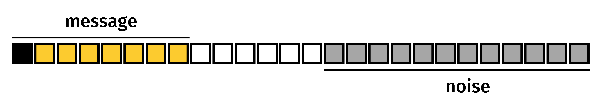
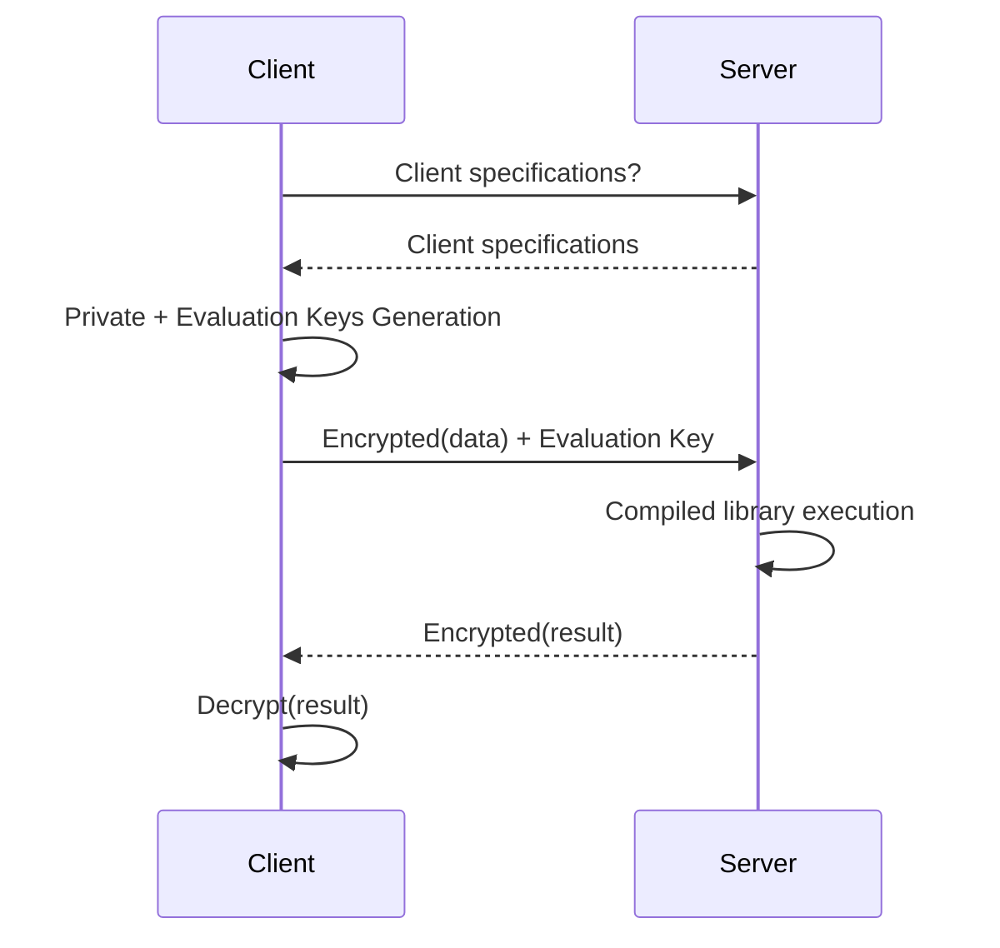

# Overview

This document explains the basic principles, key concepts, and workflow of how **Concrete** performs computations on encrypted data homomorphically.

## Computations on encrypted values

Homomorphic encryption allows you to perform computations on ciphertexts without knowing the underlying messages. A scheme is considered [fully homomorphic](https://en.wikipedia.org/wiki/Homomorphic_encryption#Fully_homomorphic_encryption) if it supports an unlimited number of additions and multiplications.ß

* homomorphic addition: $$E[x] + E[y] = E[x + y]$$
* homomorphic multiplication: $$E[x] * E[y] = E[x * y]$$

$$x$$ is a plaintext and $$E[x]$$ is the corresponding ciphertext.

## Noise and bootstrap

Fully Homomorphic Encryption (FHE) encrypts data as Learning With Errors (LWE) ciphertexts.

The following illustration visualizes LWE ciphertexts as a bit vector:

* The higher-order bits in yellow contain the encrypted message
* The lower-order bits in grey contain a random part called **noise**, ensuring the encrypted message's security.



Each time you perform an operation on an encrypted value, the noise increases. Eventually, the noise may overlap with the message, corrupting its value. To avoid this, we reduce the noise in a cipher text using the **bootstrapping operation**.

The bootstrapping operation takes a noisy ciphertext as input and generates a new ciphertext encrypting the same message but with a lower noise. This reduction allows you to perform additional operations on the same encrypted message.

A typical FHE program consists of a series of operations followed by a bootstrapping, and then the cycle repeats.

## Probability of error

The amount of noise is drawn randomly from a Gaussian distribution, so the size can vary. It is essential to ensure that the noise terms do not interfere with the message bits. If the noise terms overflow into the message bits, they can cause an incorrect output during bootstrapping.

In **Concrete**, the default probability of error is set to $$frac{1}{100000}$$. This means that 1 out of every 100,000 executions may result in an incorrect output.

A lower probability of error may increase the accuracy but degrade the performance, reversely, a higher probability of error will likely speed up operations. You can change the probability of error by adjusting the cryptographic parameters.

## Function evaluation

Besides the arithmetic operations that we have introduced, a typical program usually also involves functions such as maximum, minimum, square root, and so on.

During the bootstrapping operation, you can perform a [Table Lookup](table_lookups/) (TLU) simultaneously to reduce noise, turning the [bootstrapping operation](fhe_basics.md#noise-and-bootstrap) into a Programmable Bootstrap (PBS).

**Concrete** uses the PBS to support function evaluation:

* Homomorphic univariate function evaluation: $$f(E[x]) = E[f(x)]$$

Here is a simple example: a function that takes a 4-bit input variable and outputs the maximum value between a clear constant and the encrypted input:

```python
import numpy as np

def encrypted_max(x: uint4):
    return np.maximum(5, x)
```

This function can be turned into a TLU:

```python
def encrypted_max(x: uint4):
    lut = [5, 5, 5, 5, 5, 5, 6, 7, 8, 9, 10, 11, 12, 13, 14, 15]
    return lut[x]
```

**Concrete** applies this lookup table `lut` during the Programmable Bootstrap.

## PBS management

During compilation, **Concrete** handles the entire PBS management by turning each function evaluation into a TLU and then evaluating it by a PBS. You don't have to manage PBS by yourself.

Refer to the MLIR code produced by the previous example, you'll see the lookup table value on the 4th line:

```cpp
module {
  func.func @main(%arg0: !FHE.eint<4>) -> !FHE.eint<4> {
    %cst = arith.constant dense<[5, 5, 5, 5, 5, 5, 6, 7, 8, 9, 10, 11, 12, 13, 14, 15]> : tensor<16xi64>
    %0 = "FHE.apply_lookup_table"(%arg0, %cst) : (!FHE.eint<4>, tensor<16xi64>) -> !FHE.eint<4>
    return %0 : !FHE.eint<4>
  }
}
```

Some considerations about PBS:

* **Input type:** PBS adds a constraint on the input type, that's why **Concrete** supports a limited width.
* **PBS cost:**
  * PBSs are the most costly operations in FHE.
    * The number of PBSs used in your circuit is an important metric to optimize the performance. The fewer PBS you have in your circuit, the faster the execution runs.
  * PBS cost varies with input variable precision.
    * For example, a circuit with 8-bit PBS will run faster than one with 16-bit PBS.

## Development workflow

Computation on encrypted data is particularly useful in the client/server model, especially when the client data are sensitive and the server is not trusted.

You can split the workflow into two steps: development and deployment.

### Development

During development, you will convert your program into its FHE equivalent. **Concrete** automates this task through the compilation process, but you go further by:

* Reducing the precision required
* Decreasing the number of PBSs
* Allowing more parallelization in your code. For example, working on smaller-bit chunks instead of larger-bit variables.

Once you finish the code, you will create the compiler artifact to use during deployment.

### Deployment

A typical **Concrete** deployment hosts the compilation artifact on a server, which includes the client specifications that the compiled circuits require and the executable FHE.

The client will go through the following steps:

1. Request the circuit requirements
2. Generate keys accordingly
3. Send an encrypted payload
4. Receive an encrypted result



For more information on deployment, see [the deployment documentation](../guides/deploy.md).
