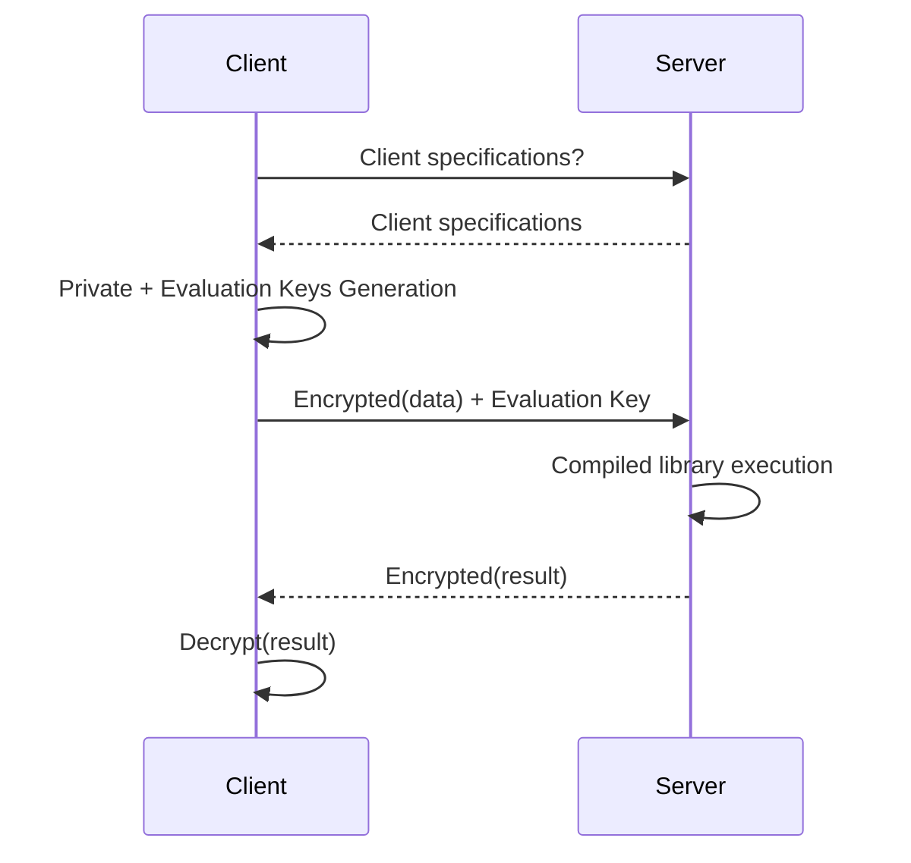

# Overview

## Operations on encrypted values

The idea of homomorphic encryption is that you can compute on ciphertexts without knowing the messages they encrypt. A scheme is said to be [fully homomorphic](https://en.wikipedia.org/wiki/Homomorphic\_encryption#Fully\_homomorphic\_encryption), if an unlimited number of additions and multiplications are supported ($$x$$ is a plaintext and $$E[x]$$ is the corresponding ciphertext):

* homomorphic addition: $$E[x] + E[y] = E[x + y]$$
* homomorphic multiplication: $$E[x] * E[y] = E[x * y]$$

## Noise and Bootstrap

FHE encrypts data as LWE ciphertexts. These ciphertexts can be visually represented as a bit vector with the encrypted message in the higher-order (yellow) bits as well as a random part (gray), that guarantees the security of the encrypted message, called noise.


Under the hood, each time you perform an operation on an encrypted value, the noise grows and at a certain point, it may overlap with the message and corrupt its value.

There is a way to decrease the noise of a ciphertext with the **Bootstrap operation**. The bootstrap operation takes as input a noisy ciphertext and generates a new ciphertext encrypting the same message, but with a lower noise. This allows additional operations to be performed on the encrypted message.

A typical FHE program will be made up of a series of operations followed by a Bootstrap, this is then repeated many times.

## Probability of Error

The amount of noise in a ciphertext is not as bounded as it may appear in the above illustration. As the errors are drawn randomly from a Gaussian distribution, they can be of varying size. This means that we need to be careful to ensure the noise terms do not affect the message bits. If the error terms do overflow into the message bits, this can cause an incorrect output (failure) when bootstrapping.

The default failure probability in Concrete is set for the whole program and is $$\frac{1}{100000}$$ by default. This means that 1 execution of every 100,000 may result in an incorrect output. To have a lower probability of error, you need to change the cryptographic parameters, likely resulting in worse performance. On the other side of this trade-off, allowing a higher probability of error will likely speed-up operations.

## Function evaluation

So far, we only introduced arithmetic operations but a typical program usually also involves functions (maximum, minimum, square root…)

During the Bootstrap operation, in TFHE, you could perform a table lookup simultaneously to reduce noise, turning the Bootstrap operation into a Programmable Bootstrap (PBS).

Concrete uses the PBS to support function evaluation:

* homomorphic univariate function evaluation: $$f(E[x]) = E[f(x)]$$

Let's take a simple example. A function (or circuit) that takes a 4 bits input variable and output the maximum value between a clear constant and the encrypted input:

example:

```python
import numpy as np

def encrypted_max(x: uint4):
    return np.maximum(5, x)
```

could be turned into a table lookup:

```python
def encrypted_max(x: uint4):
    lut = [5, 5, 5, 5, 5, 5, 6, 7, 8, 9, 10, 11, 12, 13, 14, 15]
    return lut[x]
```

The Lookup table `lut` being applied during the Programmable Bootstrap.

## PBS management

You should not worry about PBS, they are completely managed by Concrete during the compilation process. Each function evaluation will be turned into a Lookup table and evaluated by a PBS.

See this in action with the previous example, if you dump the MLIR code produced by the frontend, you will see (forget about MLIR syntax, just see the Lookup table value on the 4th line):

```c++
module {
  func.func @main(%arg0: !FHE.eint<4>) -> !FHE.eint<4> {
    %cst = arith.constant dense<[5, 5, 5, 5, 5, 5, 6, 7, 8, 9, 10, 11, 12, 13, 14, 15]> : tensor<16xi64>
    %0 = "FHE.apply_lookup_table"(%arg0, %cst) : (!FHE.eint<4>, tensor<16xi64>) -> !FHE.eint<4>
    return %0 : !FHE.eint<4>
  }
}
```

The only thing you should keep in mind is that it adds a constraint on the input type, and that is the reason behind having a maximum bit-width supported in Concrete.

Second takeaway is that PBS are the most costly operations in FHE, the less PBS in your circuit the faster it will run. It is an interesting metrics to optimize (you will see that Concrete could give you the number of PBS used in your circuit).

Note also that PBS cost varies with the input variable precision (a circuit with 8 bit PBS will run faster than one with 16 bits PBS).

## Development Workflow

Allowing computation on encrypted data is particularly interesting in the client/server model, especially when the client data are sensitive and the server not trusted. You could split the workflow in two main steps: development and deployment.

### Development

During development, you will turn your program into its FHE equivalent. Concrete automates this task with the compilation process but you can make this process even easier by reducing the precision required, reducing the number of PBSs or allowing more parallelization in your code (e.g. working on bit chunks instead of high bit-width variables).

Once happy with the code, the development process is over and you will create the compiler artifact that will be used during deployment.

### Deployment

A typical Concrete deployment will host on a server the compilation artifact: Client specifications required by the compiled circuits and the fhe executable itself. Client will ask for the circuit requirements, generate keys accordingly, then it will send an encrypted payload and receive an encrypted result.



For more information on deployment, see [Howto - Deploy](../guides/deploy.md)
