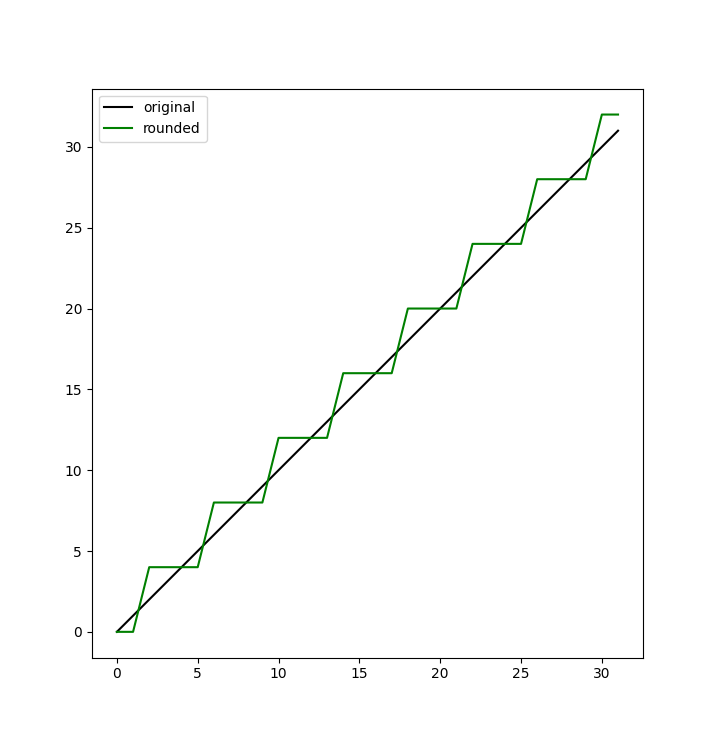
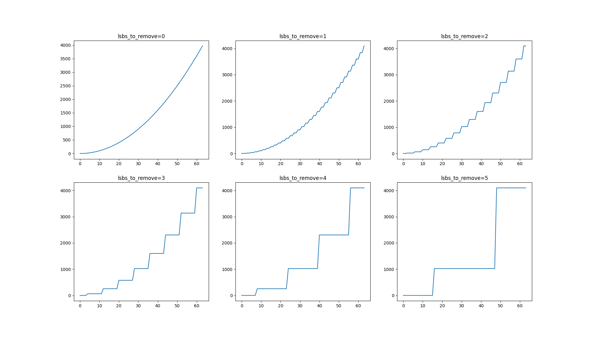
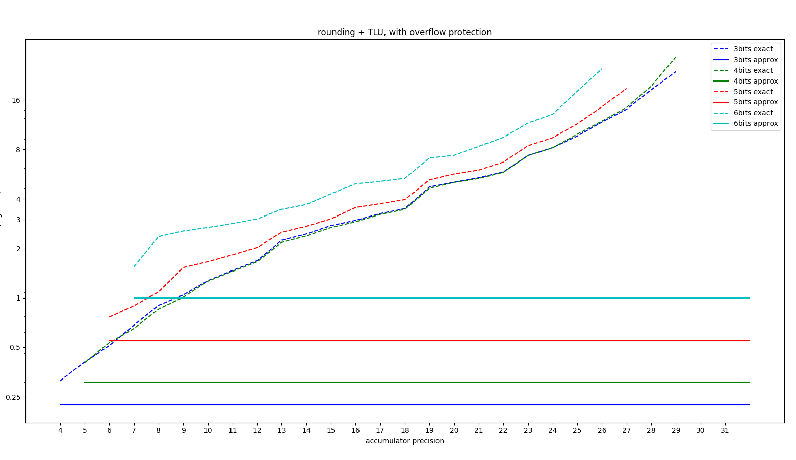
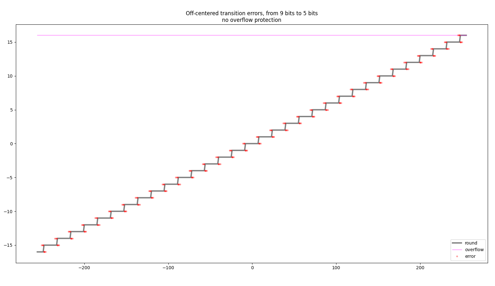
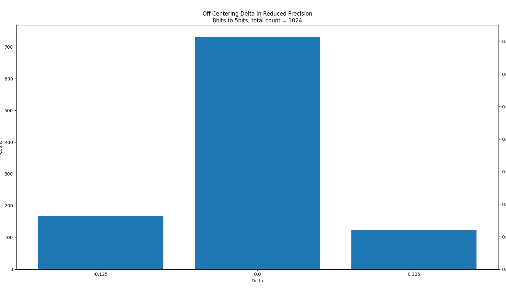
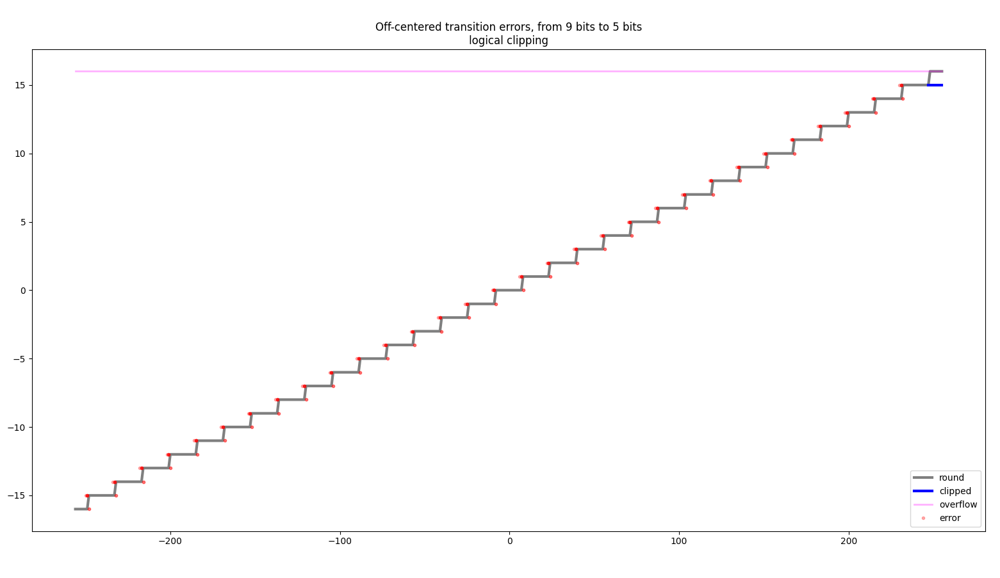
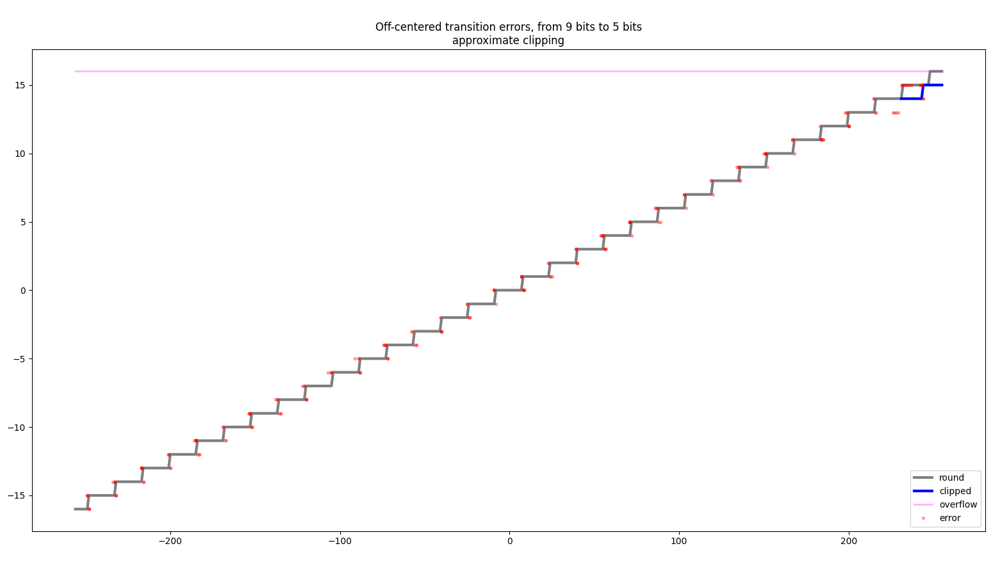

# Rounding

This document details the concept of rounding, and how it is used in Concrete to make some FHE computations especially faster.

Table lookups have a strict constraint on the number of bits they support. This can be limiting, especially if you don't need exact precision. As well as this, using larger bit-widths leads to slower table lookups.

To overcome these issues, rounded table lookups are introduced. This operation provides a way to round the least significant bits of a large integer and then apply the table lookup on the resulting (smaller) value.

Imagine you have a 5-bit value, but you want to have a 3-bit table lookup. You can call `fhe.round_bit_pattern(input, lsbs_to_remove=2)` and use the 3-bit value you receive as input to the table lookup.

Let's see how rounding works in practice:

```python
import matplotlib.pyplot as plt
import numpy as np
from concrete import fhe

original_bit_width = 5
lsbs_to_remove = 2

assert 0 < lsbs_to_remove < original_bit_width

original_values = list(range(2**original_bit_width))
rounded_values = [
    fhe.round_bit_pattern(value, lsbs_to_remove)
    for value in original_values
]

previous_rounded = rounded_values[0]
for original, rounded in zip(original_values, rounded_values):
    if rounded != previous_rounded:
        previous_rounded = rounded
        print()

    original_binary = np.binary_repr(original, width=(original_bit_width + 1))
    rounded_binary = np.binary_repr(rounded, width=(original_bit_width + 1))

    print(
        f"{original:2} = 0b_{original_binary[:-lsbs_to_remove]}[{original_binary[-lsbs_to_remove:]}] "
        f"=> "
        f"0b_{rounded_binary[:-lsbs_to_remove]}[{rounded_binary[-lsbs_to_remove:]}] = {rounded}"
    )

fig = plt.figure()
ax = fig.add_subplot()

plt.plot(original_values, original_values, label="original", color="black")
plt.plot(original_values, rounded_values, label="rounded", color="green")
plt.legend()

ax.set_aspect("equal", adjustable="box")
plt.show()
```

prints:

```
 0 = 0b_0000[00] => 0b_0000[00] = 0
 1 = 0b_0000[01] => 0b_0000[00] = 0

 2 = 0b_0000[10] => 0b_0001[00] = 4
 3 = 0b_0000[11] => 0b_0001[00] = 4
 4 = 0b_0001[00] => 0b_0001[00] = 4
 5 = 0b_0001[01] => 0b_0001[00] = 4

 6 = 0b_0001[10] => 0b_0010[00] = 8
 7 = 0b_0001[11] => 0b_0010[00] = 8
 8 = 0b_0010[00] => 0b_0010[00] = 8
 9 = 0b_0010[01] => 0b_0010[00] = 8

10 = 0b_0010[10] => 0b_0011[00] = 12
11 = 0b_0010[11] => 0b_0011[00] = 12
12 = 0b_0011[00] => 0b_0011[00] = 12
13 = 0b_0011[01] => 0b_0011[00] = 12

14 = 0b_0011[10] => 0b_0100[00] = 16
15 = 0b_0011[11] => 0b_0100[00] = 16
16 = 0b_0100[00] => 0b_0100[00] = 16
17 = 0b_0100[01] => 0b_0100[00] = 16

18 = 0b_0100[10] => 0b_0101[00] = 20
19 = 0b_0100[11] => 0b_0101[00] = 20
20 = 0b_0101[00] => 0b_0101[00] = 20
21 = 0b_0101[01] => 0b_0101[00] = 20

22 = 0b_0101[10] => 0b_0110[00] = 24
23 = 0b_0101[11] => 0b_0110[00] = 24
24 = 0b_0110[00] => 0b_0110[00] = 24
25 = 0b_0110[01] => 0b_0110[00] = 24

26 = 0b_0110[10] => 0b_0111[00] = 28
27 = 0b_0110[11] => 0b_0111[00] = 28
28 = 0b_0111[00] => 0b_0111[00] = 28
29 = 0b_0111[01] => 0b_0111[00] = 28

30 = 0b_0111[10] => 0b_1000[00] = 32
31 = 0b_0111[11] => 0b_1000[00] = 32
```

and displays:




If the rounded number is one of the last `2**(lsbs_to_remove - 1)` numbers in the input range `[0, 2**original_bit_width)`, an overflow **will** happen.

By default, if an overflow is encountered during inputset evaluation, bit-widths will be adjusted accordingly. This results in a loss of speed, but ensures accuracy.

You can turn this overflow protection off (e.g., for performance) by using `fhe.round_bit_pattern(..., overflow_protection=False)`. However, this could lead to unexpected behavior at runtime.


Now, let's see how rounding can be used in FHE.

```python
import itertools
import time

import matplotlib.pyplot as plt
import numpy as np
from concrete import fhe

configuration = fhe.Configuration(
    enable_unsafe_features=True,
    use_insecure_key_cache=True,
    insecure_key_cache_location=".keys",
    single_precision=False,
    parameter_selection_strategy=fhe.ParameterSelectionStrategy.MULTI,
)

input_bit_width = 6
input_range = np.array(range(2**input_bit_width))

timings = {}
results = {}

for lsbs_to_remove in range(input_bit_width):
    @fhe.compiler({"x": "encrypted"})
    def f(x):
        return fhe.round_bit_pattern(x, lsbs_to_remove) ** 2
    
    circuit = f.compile(inputset=[input_range], configuration=configuration)
    circuit.keygen()
    
    encrypted_sample = circuit.encrypt(input_range)
    start = time.time()
    encrypted_result = circuit.run(encrypted_sample)
    end = time.time()
    result = circuit.decrypt(encrypted_result)
    
    took = end - start
    
    timings[lsbs_to_remove] = took
    results[lsbs_to_remove] = result

number_of_figures = len(results)

columns = 1
for i in range(2, number_of_figures):
    if number_of_figures % i == 0:
        columns = i
rows = number_of_figures // columns

fig, axs = plt.subplots(rows, columns)
axs = axs.flatten()

baseline = timings[0]
for lsbs_to_remove in range(input_bit_width):
    timing = timings[lsbs_to_remove]
    speedup = baseline / timing
    print(f"lsbs_to_remove={lsbs_to_remove} => {speedup:.2f}x speedup")

    axs[lsbs_to_remove].set_title(f"lsbs_to_remove={lsbs_to_remove}")
    axs[lsbs_to_remove].plot(input_range, results[lsbs_to_remove])

plt.show()
```

prints:

```
lsbs_to_remove=0 => 1.00x speedup
lsbs_to_remove=1 => 1.20x speedup
lsbs_to_remove=2 => 2.17x speedup
lsbs_to_remove=3 => 3.75x speedup
lsbs_to_remove=4 => 2.64x speedup
lsbs_to_remove=5 => 2.61x speedup
```


These speed-ups can vary from system to system.



The reason why the speed-up is not increasing with `lsbs_to_remove` is because the rounding operation itself has a cost: each bit removal is a PBS. Therefore, if a lot of bits are removed, rounding itself could take longer than the bigger TLU which is evaluated afterwards.


and displays:




Feel free to disable overflow protection and see what happens.


## Auto Rounders

Rounding is very useful but, in some cases, you don't know how many bits your input contains, so it's not reliable to specify `lsbs_to_remove` manually. For this reason, the `AutoRounder` class is introduced.

`AutoRounder` allows you to set how many of the most significant bits to keep, but they need to be adjusted using an inputset to determine how many of the least significant bits to remove. This can be done manually using `fhe.AutoRounder.adjust(function, inputset)`, or by setting `auto_adjust_rounders` configuration to `True` during compilation.

Here is how auto rounders can be used in FHE:

```python
import itertools
import time

import matplotlib.pyplot as plt
import numpy as np
from concrete import fhe

configuration = fhe.Configuration(
    enable_unsafe_features=True,
    use_insecure_key_cache=True,
    insecure_key_cache_location=".keys",
    single_precision=False,
    parameter_selection_strategy=fhe.ParameterSelectionStrategy.MULTI,
)

input_bit_width = 6
input_range = np.array(range(2**input_bit_width))

timings = {}
results = {}

for target_msbs in reversed(range(1, input_bit_width + 1)):
    rounder = fhe.AutoRounder(target_msbs)

    @fhe.compiler({"x": "encrypted"})
    def f(x):
        return fhe.round_bit_pattern(x, rounder) ** 2

    fhe.AutoRounder.adjust(f, inputset=[input_range])

    circuit = f.compile(inputset=[input_range], configuration=configuration)
    circuit.keygen()

    encrypted_sample = circuit.encrypt(input_range)
    start = time.time()
    encrypted_result = circuit.run(encrypted_sample)
    end = time.time()
    result = circuit.decrypt(encrypted_result)

    took = end - start

    timings[target_msbs] = took
    results[target_msbs] = result

number_of_figures = len(results)

columns = 1
for i in range(2, number_of_figures):
    if number_of_figures % i == 0:
        columns = i
rows = number_of_figures // columns

fig, axs = plt.subplots(rows, columns)
axs = axs.flatten()

baseline = timings[input_bit_width]
for i, target_msbs in enumerate(reversed(range(1, input_bit_width + 1))):
    timing = timings[target_msbs]
    speedup = baseline / timing
    print(f"target_msbs={target_msbs} => {speedup:.2f}x speedup")

    axs[i].set_title(f"target_msbs={target_msbs}")
    axs[i].plot(input_range, results[target_msbs])

plt.show()
```

prints:

```
target_msbs=6 => 1.00x speedup
target_msbs=5 => 1.22x speedup
target_msbs=4 => 1.95x speedup
target_msbs=3 => 3.11x speedup
target_msbs=2 => 2.23x speedup
target_msbs=1 => 2.34x speedup
```

and displays:



`AutoRounder`s should be defined outside the function that is being compiled. They are used to store the result of the adjustment process, so they shouldn't be created each time the function is called. Furthermore, each `AutoRounder` should be used with exactly one `round_bit_pattern` call.



## Exactness

One use of rounding is doing faster computation by ignoring the lower significant bits.
For this usage, you can even get faster results if you accept the rounding it-self to be slightly inexact.
The speedup is usually around 2x-3x but can be higher for big precision reduction.
This also enable higher precisions values that are not possible otherwise.

|  |
|:--:|
| *Using the default configuration in approximate mode. For 3, 4, 5 and 6 reduced precision bits and accumulator precision up to 32bits |


You can turn on this mode either globally on the configuration:
```python
configuration = fhe.Configuration(
    ...
    rounding_exactness=fhe.Exactness.APPROXIMATE
)
```
or on/off locally:
```python
v = fhe.round_bit_pattern(v, lsbs_to_remove=2, exactness=fhe.Exactness.APPROXIMATE)
v = fhe.round_bit_pattern(v, lsbs_to_remove=2, exactness=fhe.Exactness.EXACT)
```

In approximate mode the rounding threshold up or down is not perfectly centered:
The off-centering is:
* is bounded, i.e. at worst an off-by-one on the reduced precision value compared to the exact result,
* is pseudo-random, i.e. it will be different on each call,
* almost symmetrically distributed,
* depends on cryptographic properties like the encryption mask, the encryption noise and the crypto-parameters.

|  |
|:--:|
| *In blue the exact value, the red dots are approximate values due to off-centered transition in approximate mode.* |

|  |
|:--:|
| *Histogram of transitions off-centering delta. Each count correspond to a specific random mask and a specific encryption noise.* |

## Approximate rounding features

With approximate rounding, you can enable an approximate clipping to get further improved performance in the case of overflow handling. Approximate clipping enable to discard the extra bit of overflow protection bit in the successor TLU. For consistency a logical clipping is available when this optimization is not suitable.

### Logical clipping

When fast approximate clipping is not suitable (i.e. slower), it's better to apply logical clipping for consistency and better resilience to code change.
It has no extra cost since it's fuzed with the successor TLU.

|  |
|:--:|
| *Only the last step is clipped.* |


### Approximate clipping

This set the first precision where approximate clipping is enabled, starting from this precision, an extra small precision TLU is introduced to safely remove the extra precision bit used to contain overflow. This way the successor TLU is faster.
E.g. for a rounding to 7bits, that finishes to a TLU of 8bits due to overflow, forcing to use a TLU of 7bits is 3x faster.

|  |
|:--:|
| *The last steps are decreased.* |
