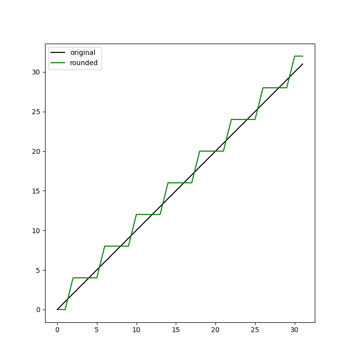
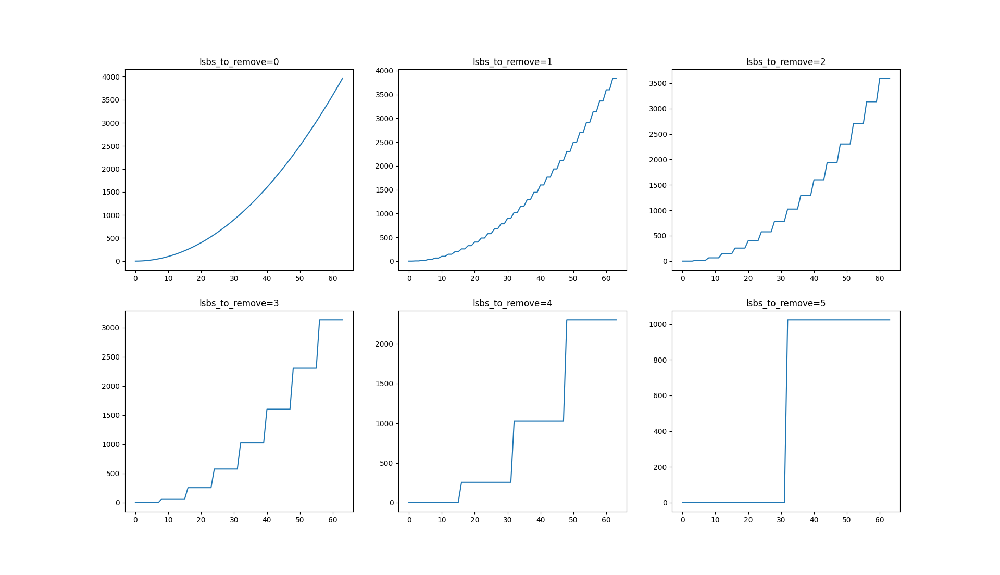
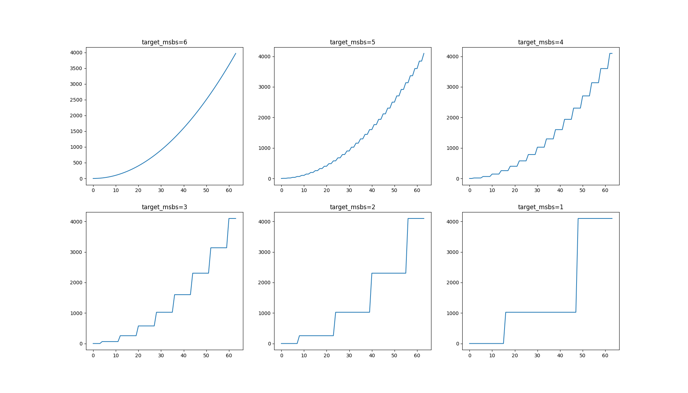

# Rounding

This document introduces the rounding operations to optimize performance in Table Lookup (TLU) operations, particularly when exact precision is not required.

## Introduction

Rounding operations provide a way to round the least significant bits of a large integer, and then apply the TLU on the smaller, rounded value. Because TLUs are computationally intensive, rounding is a good option for performance optimization. It is especially valuable for use cases where exact precision is not required.

## How it works

Let's say you have a 5-bit value and need to perform a 3-bit TLU, you can call `fhe.round_bit_pattern(input, lsbs_to_remove=2)` function to round off the last 2 bits of the input value to get the 3-bit value that you need for the TLU.

Here's an example of how rounding works in practice:

```python
import matplotlib.pyplot as plt
import numpy as np
from concrete import fhe

original_bit_width = 5
lsbs_to_remove = 2

assert 0 < lsbs_to_remove < original_bit_width

original_values = list(range(2**original_bit_width))
rounded_values = [
    fhe.round_bit_pattern(value, lsbs_to_remove)
    for value in original_values
]

previous_rounded = rounded_values[0]
for original, rounded in zip(original_values, rounded_values):
    if rounded != previous_rounded:
        previous_rounded = rounded
        print()

    original_binary = np.binary_repr(original, width=(original_bit_width + 1))
    rounded_binary = np.binary_repr(rounded, width=(original_bit_width + 1))

    print(
        f"{original:2} = 0b_{original_binary[:-lsbs_to_remove]}[{original_binary[-lsbs_to_remove:]}] "
        f"=> "
        f"0b_{rounded_binary[:-lsbs_to_remove]}[{rounded_binary[-lsbs_to_remove:]}] = {rounded}"
    )

fig = plt.figure()
ax = fig.add_subplot()

plt.plot(original_values, original_values, label="original", color="black")
plt.plot(original_values, rounded_values, label="rounded", color="green")
plt.legend()

ax.set_aspect("equal", adjustable="box")
plt.show()
```

This function prints the following results:

<details>

<summary>The results printed</summary>

```
 0 = 0b_0000[00] => 0b_0000[00] = 0
 1 = 0b_0000[01] => 0b_0000[00] = 0

 2 = 0b_0000[10] => 0b_0001[00] = 4
 3 = 0b_0000[11] => 0b_0001[00] = 4
 4 = 0b_0001[00] => 0b_0001[00] = 4
 5 = 0b_0001[01] => 0b_0001[00] = 4

 6 = 0b_0001[10] => 0b_0010[00] = 8
 7 = 0b_0001[11] => 0b_0010[00] = 8
 8 = 0b_0010[00] => 0b_0010[00] = 8
 9 = 0b_0010[01] => 0b_0010[00] = 8

10 = 0b_0010[10] => 0b_0011[00] = 12
11 = 0b_0010[11] => 0b_0011[00] = 12
12 = 0b_0011[00] => 0b_0011[00] = 12
13 = 0b_0011[01] => 0b_0011[00] = 12

14 = 0b_0011[10] => 0b_0100[00] = 16
15 = 0b_0011[11] => 0b_0100[00] = 16
16 = 0b_0100[00] => 0b_0100[00] = 16
17 = 0b_0100[01] => 0b_0100[00] = 16

18 = 0b_0100[10] => 0b_0101[00] = 20
19 = 0b_0100[11] => 0b_0101[00] = 20
20 = 0b_0101[00] => 0b_0101[00] = 20
21 = 0b_0101[01] => 0b_0101[00] = 20

22 = 0b_0101[10] => 0b_0110[00] = 24
23 = 0b_0101[11] => 0b_0110[00] = 24
24 = 0b_0110[00] => 0b_0110[00] = 24
25 = 0b_0110[01] => 0b_0110[00] = 24

26 = 0b_0110[10] => 0b_0111[00] = 28
27 = 0b_0110[11] => 0b_0111[00] = 28
28 = 0b_0111[00] => 0b_0111[00] = 28
29 = 0b_0111[01] => 0b_0111[00] = 28

30 = 0b_0111[10] => 0b_1000[00] = 32
31 = 0b_0111[11] => 0b_1000[00] = 32
```

</details>

<details>

<summary>The graph displayed</summary>



</details>


**Overflow protection:**

An overflow will happen if the rounded number is one of the last `2**(lsbs_to_remove - 1)` numbers in the input range `[0, 2**original_bit_width)`.

To prevent overflow by default, **Concrete** adjusts the bit width accordingly during inputset evaluation to ensure accuracy. However, this overflow protection could slow down performance.

If performance is a higher priority than absolute precision in your application, you can disable overflow protection by using `fhe.round_bit_pattern(..., overflow_protection=False)`. However, be aware that this might lead to unexpected behavior during runtime.


## How to use rounding in FHE

Let's see an example of how to use rounding in FHE:

```python
import itertools
import time

import matplotlib.pyplot as plt
import numpy as np
from concrete import fhe

configuration = fhe.Configuration(
    enable_unsafe_features=True,
    use_insecure_key_cache=True,
    insecure_key_cache_location=".keys",
    single_precision=False,
    parameter_selection_strategy=fhe.ParameterSelectionStrategy.MULTI,
)

input_bit_width = 6
input_range = np.array(range(2**input_bit_width))

timings = {}
results = {}

for lsbs_to_remove in range(input_bit_width):
    @fhe.compiler({"x": "encrypted"})
    def f(x):
        return fhe.round_bit_pattern(x, lsbs_to_remove) ** 2
    
    circuit = f.compile(inputset=[input_range], configuration=configuration)
    circuit.keygen()
    
    encrypted_sample = circuit.encrypt(input_range)
    start = time.time()
    encrypted_result = circuit.run(encrypted_sample)
    end = time.time()
    result = circuit.decrypt(encrypted_result)
    
    took = end - start
    
    timings[lsbs_to_remove] = took
    results[lsbs_to_remove] = result

number_of_figures = len(results)

columns = 1
for i in range(2, number_of_figures):
    if number_of_figures % i == 0:
        columns = i
rows = number_of_figures // columns

fig, axs = plt.subplots(rows, columns)
axs = axs.flatten()

baseline = timings[0]
for lsbs_to_remove in range(input_bit_width):
    timing = timings[lsbs_to_remove]
    speedup = baseline / timing
    print(f"lsbs_to_remove={lsbs_to_remove} => {speedup:.2f}x speedup")

    axs[lsbs_to_remove].set_title(f"lsbs_to_remove={lsbs_to_remove}")
    axs[lsbs_to_remove].plot(input_range, results[lsbs_to_remove])

plt.show()
```

This prints the following results:

<details>

<summary>The results printed</summary>

```
lsbs_to_remove=0 => 1.00x speedup
lsbs_to_remove=1 => 1.20x speedup
lsbs_to_remove=2 => 2.17x speedup
lsbs_to_remove=3 => 3.75x speedup
lsbs_to_remove=4 => 2.64x speedup
lsbs_to_remove=5 => 2.61x speedup
```

</details>

<details>

<summary>The graphs displayed</summary>



</details>


**About speedups:**

* The observed speedups can vary depending on system configurations.
* The speedup is not increasing with `lsbs_to_remove` because the rounding operation itself has a cost. Each bit removal involves a PBS, so removing many bits can make the rounding take longer than evaluating the larger TLU that follows.
* The results will be different if overflow protection is disabled.


## Auto Rounders

When you don't know the bit width of your input, specifying `lsbs_to_remove` manually can be unreliable. `AutoRounder` allows you to set how many of the most significant bits to keep, it adjusts the number of the least significant bits to remove based on an input set.

You can adjust this manually using `fhe.AutoRounder.adjust(function, inputset)`, or automatically by setting `auto_adjust_rounders` configuration to `True` during compilation.

The following example demonstrates how to use `AutoRounder`s in FHE:

```python
import itertools
import time

import matplotlib.pyplot as plt
import numpy as np
from concrete import fhe

configuration = fhe.Configuration(
    enable_unsafe_features=True,
    use_insecure_key_cache=True,
    insecure_key_cache_location=".keys",
    single_precision=False,
    parameter_selection_strategy=fhe.ParameterSelectionStrategy.MULTI,
)

input_bit_width = 6
input_range = np.array(range(2**input_bit_width))

timings = {}
results = {}

for target_msbs in reversed(range(1, input_bit_width + 1)):
    rounder = fhe.AutoRounder(target_msbs)

    @fhe.compiler({"x": "encrypted"})
    def f(x):
        return fhe.round_bit_pattern(x, rounder) ** 2

    fhe.AutoRounder.adjust(f, inputset=[input_range])

    circuit = f.compile(inputset=[input_range], configuration=configuration)
    circuit.keygen()

    encrypted_sample = circuit.encrypt(input_range)
    start = time.time()
    encrypted_result = circuit.run(encrypted_sample)
    end = time.time()
    result = circuit.decrypt(encrypted_result)

    took = end - start

    timings[target_msbs] = took
    results[target_msbs] = result

number_of_figures = len(results)

columns = 1
for i in range(2, number_of_figures):
    if number_of_figures % i == 0:
        columns = i
rows = number_of_figures // columns

fig, axs = plt.subplots(rows, columns)
axs = axs.flatten()

baseline = timings[input_bit_width]
for i, target_msbs in enumerate(reversed(range(1, input_bit_width + 1))):
    timing = timings[target_msbs]
    speedup = baseline / timing
    print(f"target_msbs={target_msbs} => {speedup:.2f}x speedup")

    axs[i].set_title(f"target_msbs={target_msbs}")
    axs[i].plot(input_range, results[target_msbs])

plt.show()
```

<details>

<summary>The results printed</summary>

```
target_msbs=6 => 1.00x speedup
target_msbs=5 => 1.22x speedup
target_msbs=4 => 1.95x speedup
target_msbs=3 => 3.11x speedup
target_msbs=2 => 2.23x speedup
target_msbs=1 => 2.34x speedup
```

</details>

<details>

<summary>The graphs displayed</summary>



</details>


`AutoRounder` is designed to store the result of the adjustment process, so you don't have to create one each time the function is called. Therefore, you should define `AutoRounder` outside the function that is being compiled. Furthermore, use each `AutoRounder` exactly with one `round_bit_pattern` call.


## Approximate rounding

Rounding speeds up computations by ignoring the lower significant bits usually 2 to 3 times. If your application can tolerate slight inexactness in the rounding itself, you can achieve even faster results with the approximate mode.

This method also enables higher precision values that would otherwise be unattainable.

<figure><figcaption><p>Using the default configuration in approximate mode. For 3, 4, 5, and 6 reduced precision bits and accumulator precision up to 32bits</p></figcaption></figure>

You can enable this mode globally in the configuration:

```python
configuration = fhe.Configuration(
    ...
    rounding_exactness=fhe.Exactness.APPROXIMATE
)
```

or toggle it on/off locally:

```python
v = fhe.round_bit_pattern(v, lsbs_to_remove=2, exactness=fhe.Exactness.APPROXIMATE)
v = fhe.round_bit_pattern(v, lsbs_to_remove=2, exactness=fhe.Exactness.EXACT)
```

In approximate mode, the rounding threshold is not perfectly centered. The off-centering characteristics are:

* **Bounded errors**: the off-centering causes at worst an off-by-one error in the reduced precision value compared to the exact result.
* **Pseudo-random**: the off-centering will be different on each call.
* **Symmetrical distribution**: the rounding errors are almost symmetrically distributed around the actual midpoint.
* **Dependencies**: the rounding threshold depends on cryptographic properties like the encryption mask, the encryption noise, and the crypto-parameters.

<figure><figcaption><p><em>The blue line represents exact values, and the red dots represent approximate values due to off-centered transitions in approximate mode.</em></p></figcaption></figure>

<figure><figcaption><p><em>Histogram of transitions off-centering delta. Each count corresponds to a specific random mask and a specific encryption noise.</em></p></figcaption></figure>

### Approximate clipping

With approximate rounding, you can enable an approximate clipping to improve performance even more in the case of overflow handling. For consistency, a logical clipping is available when this optimization is not suitable.

Approximate clipping discards the extra bit of overflow protection bit in the successor TLU and makes the successor TLU faster. To do this, approximate clipping sets the first precision where it is enabled, from this precision, an extra small precision TLU is introduced to safely remove the extra precision bit used for overflow.

For example, if rounding to 7 bits causes an 8-bit TLU due to overflow, you can force it to use a 7-bit TLU, resulting in a 3x speed increase.

<figure><figcaption><p><em>The last steps are decreased.</em></p></figcaption></figure>

### Logical clipping

Use logical clipping when fast approximate clipping is not suitable, as it provides consistency and better resilience to code changes. It incurs no extra cost since it's fused with the successor TLU.

<figure><figcaption><p><em>Only the last step is clipped.</em></p></figcaption></figure>

