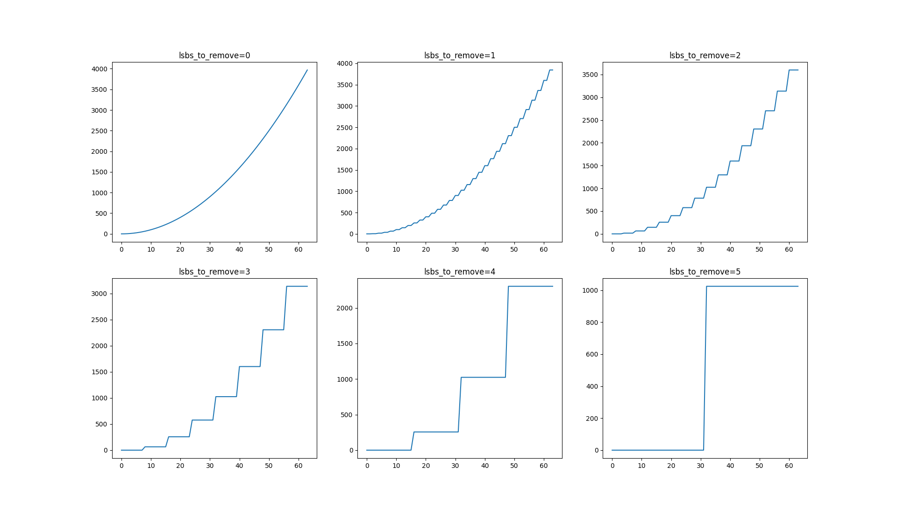
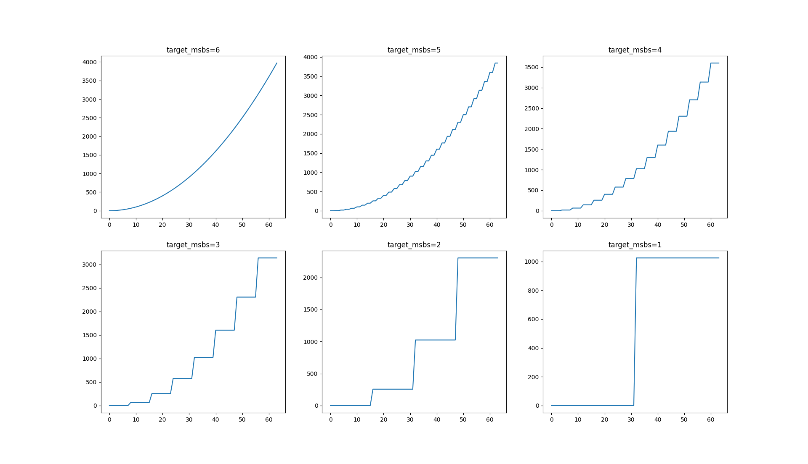

# Truncating

This document introduces the truncating operations to optimize performance in Table Lookup (TLU) operations, particularly when exact precision is not required.

## Introduction

Truncating operations provide a way to zero the least significant bits of a large integer and then apply the TLUs on the smaller, truncated value. Because TLUs are computationally intensive, truncating is a good option for performance optimization, and is especially valuable for use cases where exact precision is not required.

## How truncating works

Let's say you have a 5-bit value, you can use `fhe.truncate_bit_pattern(value, lsbs_to_remove=2)` to truncate off the last 2 bits. The value remains 5 bits after truncating, but the last 2 bits are zeroed. For instance, 22 (0b10110) is truncated to 20 (0b10100). This way, **Concrete** optimizes TLU by reducing the bit width from 5 bits to 3 bits, making it much faster.

Here is an example of how truncation works in practice:

```python
import matplotlib.pyplot as plt
import numpy as np
from concrete import fhe

original_bit_width = 5
lsbs_to_remove = 2

assert 0 < lsbs_to_remove < original_bit_width

original_values = list(range(2**original_bit_width))
truncated_values = [
    fhe.truncate_bit_pattern(value, lsbs_to_remove)
    for value in original_values
]

previous_truncated = truncated_values[0]
for original, truncated in zip(original_values, truncated_values):
    if truncated != previous_truncated:
        previous_truncated = truncated
        print()

    original_binary = np.binary_repr(original, width=(original_bit_width + 1))
    truncated_binary = np.binary_repr(truncated, width=(original_bit_width + 1))

    print(
        f"{original:2} = 0b_{original_binary[:-lsbs_to_remove]}[{original_binary[-lsbs_to_remove:]}] "
        f"=> "
        f"0b_{truncated_binary[:-lsbs_to_remove]}[{truncated_binary[-lsbs_to_remove:]}] = {truncated}"
    )

fig = plt.figure()
ax = fig.add_subplot()

plt.plot(original_values, original_values, label="original", color="black")
plt.plot(original_values, truncated_values, label="truncated", color="green")
plt.legend()

ax.set_aspect("equal", adjustable="box")
plt.show()
```

<details>

<summary>The printed results</summary>

```python
 0 = 0b_0000[00] => 0b_0000[00] = 0
 1 = 0b_0000[01] => 0b_0000[00] = 0
 2 = 0b_0000[10] => 0b_0000[00] = 0
 3 = 0b_0000[11] => 0b_0000[00] = 0

 4 = 0b_0001[00] => 0b_0001[00] = 4
 5 = 0b_0001[01] => 0b_0001[00] = 4
 6 = 0b_0001[10] => 0b_0001[00] = 4
 7 = 0b_0001[11] => 0b_0001[00] = 4

 8 = 0b_0010[00] => 0b_0010[00] = 8
 9 = 0b_0010[01] => 0b_0010[00] = 8
10 = 0b_0010[10] => 0b_0010[00] = 8
11 = 0b_0010[11] => 0b_0010[00] = 8

12 = 0b_0011[00] => 0b_0011[00] = 12
13 = 0b_0011[01] => 0b_0011[00] = 12
14 = 0b_0011[10] => 0b_0011[00] = 12
15 = 0b_0011[11] => 0b_0011[00] = 12

16 = 0b_0100[00] => 0b_0100[00] = 16
17 = 0b_0100[01] => 0b_0100[00] = 16
18 = 0b_0100[10] => 0b_0100[00] = 16
19 = 0b_0100[11] => 0b_0100[00] = 16

20 = 0b_0101[00] => 0b_0101[00] = 20
21 = 0b_0101[01] => 0b_0101[00] = 20
22 = 0b_0101[10] => 0b_0101[00] = 20
23 = 0b_0101[11] => 0b_0101[00] = 20

24 = 0b_0110[00] => 0b_0110[00] = 24
25 = 0b_0110[01] => 0b_0110[00] = 24
26 = 0b_0110[10] => 0b_0110[00] = 24
27 = 0b_0110[11] => 0b_0110[00] = 24

28 = 0b_0111[00] => 0b_0111[00] = 28
29 = 0b_0111[01] => 0b_0111[00] = 28
30 = 0b_0111[10] => 0b_0111[00] = 28
31 = 0b_0111[11] => 0b_0111[00] = 28
```

</details>

<details>

<summary>The graph displayed</summary>


</details>

## How to use truncating in FHE

Here is an example of how you can use truncating in FHE:

```python
import itertools
import time

import matplotlib.pyplot as plt
import numpy as np
from concrete import fhe

configuration = fhe.Configuration(
    enable_unsafe_features=True,
    use_insecure_key_cache=True,
    insecure_key_cache_location=".keys",
)

input_bit_width = 6
input_range = np.array(range(2**input_bit_width))

timings = {}
results = {}

for lsbs_to_remove in range(input_bit_width):
    @fhe.compiler({"x": "encrypted"})
    def f(x):
        return fhe.truncate_bit_pattern(x, lsbs_to_remove) ** 2
    
    circuit = f.compile(inputset=[input_range], configuration=configuration)
    circuit.keygen()
    
    encrypted_sample = circuit.encrypt(input_range)
    start = time.time()
    encrypted_result = circuit.run(encrypted_sample)
    end = time.time()
    result = circuit.decrypt(encrypted_result)
    
    took = end - start
    
    timings[lsbs_to_remove] = took
    results[lsbs_to_remove] = result

number_of_figures = len(results)

columns = 1
for i in range(2, number_of_figures):
    if number_of_figures % i == 0:
        columns = i
rows = number_of_figures // columns

fig, axs = plt.subplots(rows, columns)
axs = axs.flatten()

baseline = timings[0]
for lsbs_to_remove in range(input_bit_width):
    timing = timings[lsbs_to_remove]
    speedup = baseline / timing
    print(f"lsbs_to_remove={lsbs_to_remove} => {speedup:.2f}x speedup")

    axs[lsbs_to_remove].set_title(f"lsbs_to_remove={lsbs_to_remove}")
    axs[lsbs_to_remove].plot(input_range, results[lsbs_to_remove])

plt.show()
```

<details>

<summary>The results printed</summary>

```
lsbs_to_remove=0 => 1.00x speedup
lsbs_to_remove=1 => 1.69x speedup
lsbs_to_remove=2 => 3.48x speedup
lsbs_to_remove=3 => 3.06x speedup
lsbs_to_remove=4 => 3.46x speedup
lsbs_to_remove=5 => 3.14x speedup
```

</details>

<details>

<summary>The graphs displayed</summary>



</details>


**About speedups:**

* The observed speedups can vary depending on system configurations.
* The speed-up is not increasing with `lsbs_to_remove` because the truncating operation itself has a cost. Each bit removal involves a PBS, so removing many bits can make the truncating take longer than evaluating the larger TLU that follows.


## Auto Truncators

When don't know the bit width of your input, specifying `lsbs_to_remove` manually can be unreliable. `AutoTruncator` allows you to set how many of the most significant bits to keep, it adjusts the number of the least significant bits to remove based on an input set.

You can adjust this manually using `fhe.AutoTruncator.adjust(function, inputset)`, or automatically by setting `auto_adjust_truncators` configuration to `True` during compilation.

The following example demonstrates how to use `AutoTruncator` in FHE:

```python
import itertools
import time

import matplotlib.pyplot as plt
import numpy as np
from concrete import fhe

configuration = fhe.Configuration(
    enable_unsafe_features=True,
    use_insecure_key_cache=True,
    insecure_key_cache_location=".keys",
    single_precision=False,
    parameter_selection_strategy=fhe.ParameterSelectionStrategy.MULTI,
)

input_bit_width = 6
input_range = np.array(range(2**input_bit_width))

timings = {}
results = {}

for target_msbs in reversed(range(1, input_bit_width + 1)):
    truncator = fhe.AutoTruncator(target_msbs)

    @fhe.compiler({"x": "encrypted"})
    def f(x):
        return fhe.truncate_bit_pattern(x, lsbs_to_remove=truncator) ** 2

    fhe.AutoTruncator.adjust(f, inputset=[input_range])

    circuit = f.compile(inputset=[input_range], configuration=configuration)
    circuit.keygen()

    encrypted_sample = circuit.encrypt(input_range)
    start = time.time()
    encrypted_result = circuit.run(encrypted_sample)
    end = time.time()
    result = circuit.decrypt(encrypted_result)

    took = end - start

    timings[target_msbs] = took
    results[target_msbs] = result

number_of_figures = len(results)

columns = 1
for i in range(2, number_of_figures):
    if number_of_figures % i == 0:
        columns = i
rows = number_of_figures // columns

fig, axs = plt.subplots(rows, columns)
axs = axs.flatten()

baseline = timings[input_bit_width]
for i, target_msbs in enumerate(reversed(range(1, input_bit_width + 1))):
    timing = timings[target_msbs]
    speedup = baseline / timing
    print(f"target_msbs={target_msbs} => {speedup:.2f}x speedup")

    axs[i].set_title(f"target_msbs={target_msbs}")
    axs[i].plot(input_range, results[target_msbs])

plt.show()
```

This program prints the following results:

<details>

<summary>The results printed</summary>

```
target_msbs=6 => 1.00x speedup
target_msbs=5 => 1.80x speedup
target_msbs=4 => 3.47x speedup
target_msbs=3 => 3.02x speedup
target_msbs=2 => 3.38x speedup
target_msbs=1 => 3.37x speedup
```

</details>

<details>

<summary>The graphs displayed</summary>



</details>


`AutoTruncator` is designed to store the result of the adjustment process, so you don't have to create one each time the function is called. Therefore, you should define `AutoTruncator` outside the function that is being compiled. Furthermore, use each `AutoTruncator` exactly with one `truncate_bit_pattern` call.

