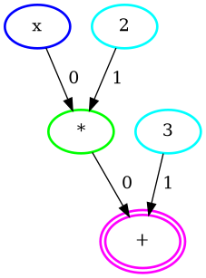

# Compilation

This document explains the different passes happening in the compilation process, from the Concrete Python frontend to the Concrete MLIR compiler.

There are two main entry points to the Concrete Compiler. The first is to use the Concrete Python frontend. The second is to use the Compiler directly, which takes [MLIR](https://mlir.llvm.org/) as input. Concrete Python is more high level and uses the Compiler under the hood.

Compilation begins in the **frontend** with tracing to get an easy-to-manipulate representation of the function. We call this representation a `Computation Graph`, which is a Directed Acyclic Graph (DAG) containing nodes representing computations done in the function. Working with graphs is useful because they have been studied extensively and there are a lot of available algorithms to manipulate them. Internally, we use [networkx](https://networkx.org), which is an excellent graph library for Python.

The next step in compilation is transforming the computation graph. There are many transformations we perform, and these are discussed in their own sections. The result of a transformation is another computation graph.

After transformations are applied, we need to determine the bounds (i.e., the minimum and the maximum values) of each intermediate node. This is required because FHE allows limited precision for computations. Measuring these bounds helps determine the required precision for the function.

The **frontend** is almost done at this stage and only needs to transform the computation graph to equivalent `MLIR` code. Once the `MLIR` is generated, our Compiler **backend** takes over. Any other **frontend** wishing to use the Compiler needs to plugin at this stage.

The Compiler takes `MLIR` code that makes use of both the `FHE` and `FHELinalg` [dialects](https://mlir.llvm.org/docs/LangRef/#dialects) for scalar and tensor operations respectively.

Compilation then ends with a series of [passes](#mlir-compiler-passes) that generates a native binary which contains executable code. Crypto parameters are generated along the way as well.

## Tracing

We start with a Python function `f`, such as this one:

```
def f(x):
    return (2 * x) + 3
```

The goal of tracing is to create the following computation graph without requiring any change from the user.



(Note that the edge labels are for non-commutative operations. To give an example, a subtraction node represents `(predecessor with edge label 0) - (predecessor with edge label 1)`)

To do this, we make use of `Tracer`s, which are objects that record the operation performed during their creation. We create a `Tracer` for each argument of the function and call the function with those `Tracer`s. `Tracer`s make use of the operator overloading feature of Python to achieve their goal:

```
def f(x, y):
    return x + 2 * y

x = Tracer(computation=Input("x"))
y = Tracer(computation=Input("y"))

resulting_tracer = f(x, y)
```

`2 * y` will be performed first, and `*` is overloaded for `Tracer` to return another tracer: `Tracer(computation=Multiply(Constant(2), self.computation))`, which is equal to `Tracer(computation=Multiply(Constant(2), Input("y")))`.

`x + (2 * y)` will be performed next, and `+` is overloaded for `Tracer` to return another tracer: `Tracer(computation=Add(self.computation, (2 * y).computation))`, which is equal to `Tracer(computation=Add(Input("x"), Multiply(Constant(2), Input("y")))`.

In the end, we will have output tracers that can be used to create the computation graph. The implementation is a bit more complex than this, but the idea is the same.

Tracing is also responsible for indicating whether the values in the node would be encrypted or not. The rule for that is: if a node has an encrypted predecessor, it is encrypted as well.

## Topological transforms

The goal of topological transforms is to make more functions compilable.

With the current version of **Concrete**, floating-point inputs and floating-point outputs are not supported. However, if the floating-point operations are intermediate operations, they can sometimes be fused into a single table lookup from integer to integer, thanks to some specific transforms.

Let's take a closer look at the transforms we can currently perform.

### Fusing.

We have allocated a whole new chapter to explaining fusing. You can find it [here](../../explanations/fusing.md).

## Bounds measurement

Given a computation graph, the goal of the bounds measurement step is to assign the minimal data type to each node in the graph.

If we have an encrypted input that is always between `0` and `10`, we should assign the type `EncryptedScalar<uint4>` to the node of this input as `EncryptedScalar<uint4>`. This is the minimal encrypted integer that supports all values between `0` and `10`.

If there were negative values in the range, we could have used `intX` instead of `uintX`.

Bounds measurement is necessary because FHE supports limited precision, and we don't want unexpected behaviour while evaluating the compiled functions.

Let's take a closer look at how we perform bounds measurement.

### Inputset evaluation

This is a simple approach that requires an inputset to be provided by the user.

The inputset is not to be confused with the dataset, which is classical in ML, as it doesn't require labels. Rather, the inputset is a set of values which are typical inputs of the function.

The idea is to evaluate each input in the inputset and record the result of each operation in the computation graph. Then we compare the evaluation results with the current minimum/maximum values of each node and update the minimum/maximum accordingly. After the entire inputset is evaluated, we assign a data type to each node using the minimum and maximum values it contains.

Here is an example, given this computation graph where `x` is encrypted:


and this inputset:

```
[2, 3, 1]
```

Evaluation result of `2`:

* `x`: 2
* `2`: 2
* `*`: 4
* `3`: 3
* `+`: 7

New bounds:

* `x`: \[**2**, **2**]
* `2`: \[**2**, **2**]
* `*`: \[**4**, **4**]
* `3`: \[**3**, **3**]
* `+`: \[**7**, **7**]

Evaluation result of `3`:

* `x`: 3
* `2`: 2
* `*`: 6
* `3`: 3
* `+`: 9

New bounds:

* `x`: \[2, **3**]
* `2`: \[2, 2]
* `*`: \[4, **6**]
* `3`: \[3, 3]
* `+`: \[7, **9**]

Evaluation result of `1`:

* `x`: 1
* `2`: 2
* `*`: 2
* `3`: 3
* `+`: 5

New bounds:

* `x`: \[**1**, 3]
* `2`: \[2, 2]
* `*`: \[**2**, 6]
* `3`: \[3, 3]
* `+`: \[**5**, 9]

Assigned data types:

* `x`: EncryptedScalar<**uint2**>
* `2`: ClearScalar<**uint2**>
* `*`: EncryptedScalar<**uint3**>
* `3`: ClearScalar<**uint2**>
* `+`: EncryptedScalar<**uint4**>

## MLIR Compiler Passes

We describe below some of the main passes in the compilation pipeline.

### FHE to TFHE

This pass converts high level operations which are not crypto specific to lower level operations from the TFHE scheme. Ciphertexts get introduced in the code as well. TFHE operations and ciphertexts require some parameters which need to be chosen, and the [TFHE Parameterization](#tfhe-parameterization) pass does just that.

### TFHE Parameterization

TFHE Parameterization takes care of introducing the chosen parameters in the Intermediate Representation (IR). After this pass, you should be able to see the dimension of ciphertexts, as well as other parameters in the IR.

### TFHE to Concrete

This pass lowers TFHE operations to low level operations that are closer to the backend implementation, working on tensors and memory buffers (after a bufferization pass).

### Concrete to LLVM

This pass lowers everything to LLVM-IR in order to generate the final binary.
