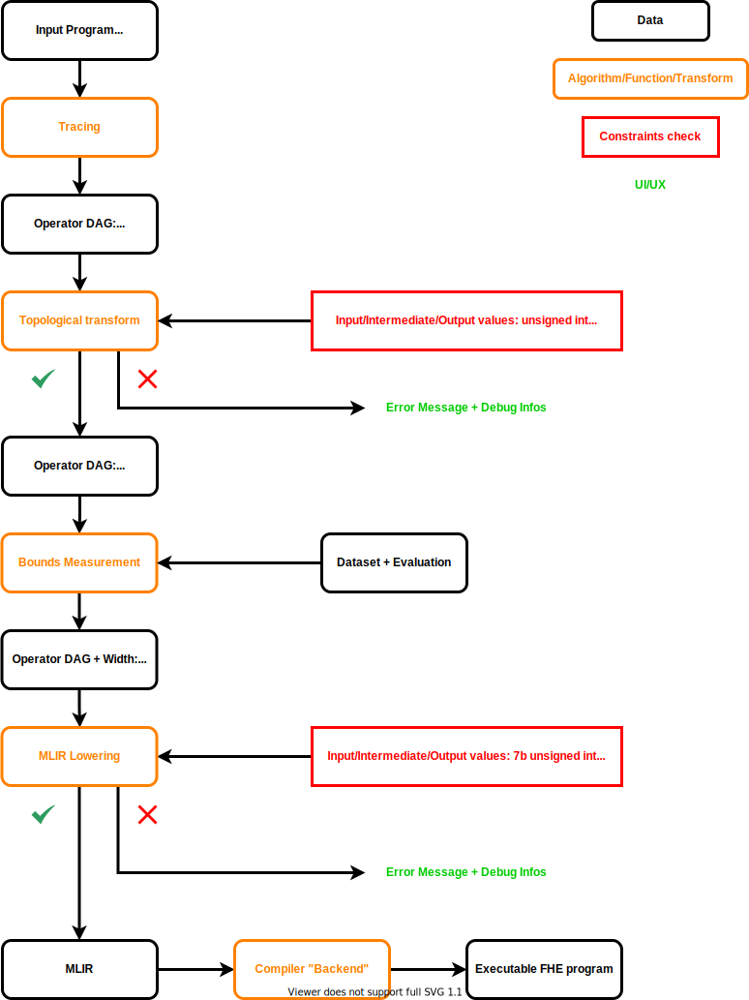
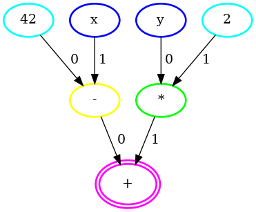

# Compilation Pipeline In Depth

## What is concretefhe?

`concretefhe` is the python API of the `concrete` framework for developing homomorphic applications.
One of its essential functionalities is to transform Python functions to their `MLIR` equivalent.
Unfortunately, not all python functions can be converted due to the limits of current product (we are in the alpha stage), or sometimes due to inherent restrictions of FHE itself.
However, one can already build interesting and impressing use cases, and more will be available in further versions of the framework.

## How can I use it?

```python
# Import necessary concrete components
import concrete.numpy as hnp

# Define the function to homomorphize
def f(x, y):
    return (2 * x) + y

# Define the inputs of homomorphized function
x = hnp.EncryptedScalar(hnp.UnsignedInteger(2))
y = hnp.EncryptedScalar(hnp.UnsignedInteger(1))

# Compile the function to its homomorphic equivalent
engine = hnp.compile_numpy_function(
    f, {"x": x, "y": y},
    iter([(0, 0), (0, 1), (1, 0), (1, 1), (2, 0), (2, 1), (3, 0), (3, 1)]),
)

# Make homomorphic inference
engine.run([1, 0])
```

## Overview

The compilation journey begins with tracing to get an easy to understand and manipulate representation of the function.
We call this representation `Operation Graph` which is basically a Directed Acyclic Graph (DAG) containing nodes representing the computations done in the function.
Working with graphs is good because they have been studied extensively over the years and there are a lot of algorithms to manipulate them.
Internally, we use [networkx](https://networkx.org) which is an excellent graph library for Python.

The next step in the compilation is transforming the operation graph.
There are many transformations we perform, and they will be discussed in their own sections.
In any case, the result of transformations is just another operation graph.

After transformations are applied, we need to determine the bounds (i.e., the minimum and the maximum values) of each intermediate result.
This is required because FHE currently allows a limited precision for computations.
Bound measurement is our way to know what is the needed precision for the function.
There are several approaches to compute bounds, and they will be discussed in their own sections.

The final step is to transform the operation graph to equivalent `MLIR` code.
How this is done will be explained in detail in its own chapter.

Once the MLIR is prepared, the rest of the stack, which you can learn more about [here](http://fixme.com/), takes over and completes the compilation process.

Here is the visual representation of the pipeline:



## Tracing

Given a Python function `f` such as this one,

```
def f(x):
    return (2 * x) + 3
```

the goal of tracing is to create the following operation graph without needing any change from the user.


(Note that the edge labels are for non-commutative operations. To give an example, a subtraction node represents `(predecessor with edge label 0) - (predecessor with edge label 1)`)

To do this, we make use of `Tracer`s, which are objects that record the operation performed during their creation.
We create a `Tracer` for each argument of the function and call the function with those tracers.
`Tracer`s make use of operator overloading feature of Python to achieve their goal.

Here is an example:

```
def f(x, y):
    return x + 2 * y

x = Tracer(computation=Input("x"))
y = Tracer(computation=Input("y"))

resulting_tracer = f(x, y)
```

`2 * y` will be performed first, and `*` is overloaded for `Tracer` to return another tracer:
`Tracer(computation=Multiply(Constant(2), self.computation))` which is equal to:
`Tracer(computation=Multiply(Constant(2), Input("y")))`

`x + (2 * y)` will be performed next, and `+` is overloaded for `Tracer` to return another tracer:
`Tracer(computation=Add(self.computation, (2 * y).computation))` which is equal to:
`Tracer(computation=Add(Input("x"), Multiply(Constant(2), Input("y")))`

In the end we will have output `Tracer`s that can be used to create the operation graph.
The implementation is a bit more complex than that but the idea is the same.

Tracing is also responsible for indicating whether the values in the node would be encrypted or not, and the rule for that is if a node has an encrypted predecessor, it is encrypted as well.

## Topological transforms

The goal of topological transforms is to make more functions compilable.

With the current version of `concrete` floating point inputs and floating point outputs are not supported.
However, if the floating points operations are intermediate operations, they can sometimes be fused into a single table lookup from integer to integer thanks to some specific transforms.

Let's take a closer look at the transforms we perform today.

### Fusing floating point operations

We decided to allocate a whole new chapter to explain float fusing.
You can find it [here](./FLOAT-FUSING.md).

## Bounds measurement

Given an operation graph, goal of the bound measurement step is to assign the minimal data type to each node in the graph.

Let's say we have an encrypted input that is always between `0` and `10`, we should assign the type `Encrypted<uint4>` to node of this input as `Encrypted<uint4>` is the minimal encrypted integer that supports all the values between `0` and `10`.

If there were negative values in the range, we could have used `intX` instead of `uintX`.

Bounds measurement is necessary because FHE supports limited precision, and we don't want unexpected behaviour during evaluation of the compiled functions.

There are several ways to perform bounds measurement.
Let's take a closer look at the options we provide today.

### Inputset evaluation

This is the simplest approach, but it requires an inputset to be provided by the user.

The inputset is not to be confused with the dataset which is classical in ML, as it doesn't require labels.
Rather, it is a set of values which are typical inputs of the function.

The idea is to evaluate each input in the inputset and record the result of each operation in the operation graph.
Then we compare the evaluation results with the current minimum/maximum values of each node and update the minimum/maximum accordingly.
After the entire inputset is evaluated, we assign a data type to each node using the minimum and the maximum value it contained.

Here is an example, given this operation graph where `x` is encrypted:


and this inputset:

```
[2, 3, 1]
```

Evaluation Result of `2`:
- `x`: 2
- `2`: 2
- `*`: 4
- `3`: 3
- `+`: 7

New Bounds:
- `x`: [**2**, **2**]
- `2`: [**2**, **2**]
- `*`: [**4**, **4**]
- `3`: [**3**, **3**]
- `+`: [**7**, **7**]

Evaluation Result of `3`:
- `x`: 3
- `2`: 2
- `*`: 6
- `3`: 3
- `+`: 9

New Bounds:
- `x`: [2, **3**]
- `2`: [2, 2]
- `*`: [4, **6**]
- `3`: [3, 3]
- `+`: [7, **9**]

Evaluation Result of `1`:
- `x`: 1
- `2`: 2
- `*`: 2
- `3`: 3
- `+`: 5

New Bounds:
- `x`: [**1**, 3]
- `2`: [2, 2]
- `*`: [**2**, 6]
- `3`: [3, 3]
- `+`: [**5**, 9]

Assigned Data Types:
- `x`: Encrypted\<**uint2**>
- `2`: Clear\<**uint2**>
- `*`: Encrypted\<**uint3**>
- `3`: Clear\<**uint2**>
- `+`: Encrypted\<**uint4**>

## MLIR conversion

The actual compilation will be done by the concrete compiler, which is expecting an MLIR input. The MLIR conversion goes from an operation graph to its MLIR equivalent. You can read more about it [here](./MLIR.md)

## Example walkthrough #1

### Function to homomorphize

```
def f(x):
    return (2 * x) + 3
```

### Parameters

```
x = EncryptedScalar(UnsignedInteger(2))
```

#### Corresponding operation graph


### Topological transforms

#### Fusing floating point operations

This transform isn't applied since the computation doesn't involve any floating point operations.

### Bounds measurement using [2, 3, 1] as inputset (same settings as above)

Data Types:
- `x`: Encrypted\<**uint2**>
- `2`: Clear\<**uint2**>
- `*`: Encrypted\<**uint3**>
- `3`: Clear\<**uint2**>
- `+`: Encrypted\<**uint4**>

### MLIR lowering

```
module  {
  func @main(%arg0: !HLFHE.eint<4>) -> !HLFHE.eint<4> {
    %c3_i5 = constant 3 : i5
    %c2_i5 = constant 2 : i5
    %0 = "HLFHE.mul_eint_int"(%arg0, %c2_i5) : (!HLFHE.eint<4>, i5) -> !HLFHE.eint<4>
    %1 = "HLFHE.add_eint_int"(%0, %c3_i5) : (!HLFHE.eint<4>, i5) -> !HLFHE.eint<4>
    return %1 : !HLFHE.eint<4>
  }
}
```


## Example walkthrough #2

### Function to homomorphize

```
def f(x, y):
    return (42 - x) + (y * 2)
```

### Parameters

```
x = EncryptedScalar(UnsignedInteger(3))
y = EncryptedScalar(UnsignedInteger(1))
```

#### Corresponding operation graph



### Topological transforms

#### Fusing floating point operations

This transform isn't applied since the computation doesn't involve any floating point operations.

### Bounds measurement using [(6, 0), (5, 1), (3, 0), (4, 1)] as inputset

Evaluation Result of `(6, 0)`:
- `42`: 42
- `x`: 6
- `y`: 0
- `2`: 2
- `-`: 36
- `*`: 0
- `+`: 36

Evaluation Result of `(5, 1)`:
- `42`: 42
- `x`: 5
- `y`: 1
- `2`: 2
- `-`: 37
- `*`: 2
- `+`: 39

Evaluation Result of `(3, 0)`:
- `42`: 42
- `x`: 3
- `y`: 0
- `2`: 2
- `-`: 39
- `*`: 0
- `+`: 39

Evaluation Result of `(4, 1)`:
- `42`: 42
- `x`: 4
- `y`: 1
- `2`: 2
- `-`: 38
- `*`: 2
- `+`: 40

Bounds:
- `42`: [42, 42]
- `x`: [3, 6]
- `y`: [0, 1]
- `2`: [2, 2]
- `-`: [36, 39]
- `*`: [0, 2]
- `+`: [36, 40]

Data Types:
- `42`: Clear\<**uint6**>
- `x`: Encrypted\<**uint3**>
- `y`: Encrypted\<**uint1**>
- `2`: Clear\<**uint2**>
- `-`: Encrypted\<**uint6**>
- `*`: Encrypted\<**uint2**>
- `+`: Encrypted\<**uint6**>

### MLIR lowering

```
module  {
  func @main(%arg0: !HLFHE.eint<6>, %arg1: !HLFHE.eint<6>) -> !HLFHE.eint<6> {
    %c42_i7 = constant 42 : i7
    %c2_i7 = constant 2 : i7
    %0 = "HLFHE.sub_int_eint"(%c42_i7, %arg0) : (i7, !HLFHE.eint<6>) -> !HLFHE.eint<6>
    %1 = "HLFHE.mul_eint_int"(%arg1, %c2_i7) : (!HLFHE.eint<6>, i7) -> !HLFHE.eint<6>
    %2 = "HLFHE.add_eint"(%0, %1) : (!HLFHE.eint<6>, !HLFHE.eint<6>) -> !HLFHE.eint<6>
    return %2 : !HLFHE.eint<6>
  }
}
```
