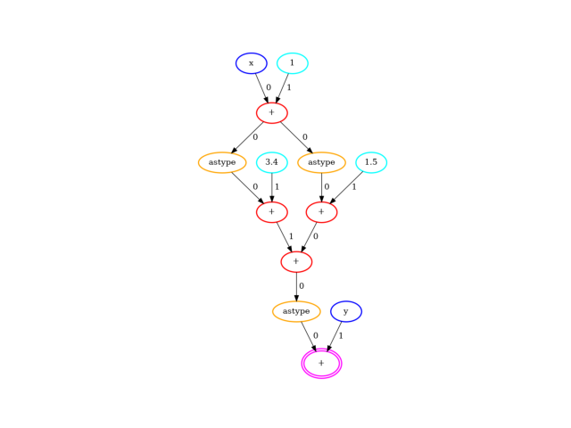
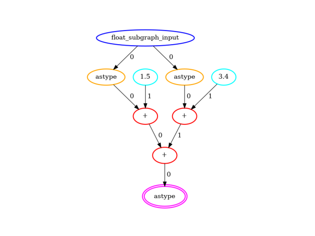

# Fusing Floating Point Operations

## Why is it needed?

The current compiler stack only supports integers with 7 bits or less. But it's not uncommon to have numpy code using floating point numbers.

We added fusing floating point operations to make tracing numpy functions somewhat user friendly to allow in-line quantization in the numpy code e.g.:

<!--pytest-codeblocks:skip-->
```python
import numpy

def quantized_sin(x):
    # from a 7 bit unsigned integer x, compute z in the [0; 2 * pi] range
    z = 2 * numpy.pi * x * (1 / 127)
    # quantize over 6 bits and offset to be >= 0, round and convert to integers in range [0; 63]
    quantized_sin = numpy.rint(31 * numpy.sin(z) + 31).astype(numpy.int64)
    # output quantized_sin and a further offset result
    return quantized_sin, quantized_sin + 32
```

This function `quantized_sin` is not strictly supported as is by the compiler as there are floating point intermediate values. However, when looking at the function globally we can see we have a single integer input and a single integer output. As we know the input range we can compute a table to represent the whole computation for each input value, which can later be lowered to a PBS in the FHE world.

Any computation where there is a single variable integer input and a single integer output can be replaced by an equivalent table lookup.

The `quantized_sin` graph of operations:


The float subgraph that was detected:


The simplified graph of operations with the float subgraph condensed in a `GenericFunction` node:


## How is it done in **Concrete Numpy**?

The first step consists in detecting where we go from floating point computation back to integers. This allows the identification of the potential terminal node of the float subgraph we are going to fuse.

From the terminal node, we go back up through the nodes until we find nodes that go from integers to floats. If we find a single node then we have a fusable subgraph that we replace by an equivalent GenericFunction node and stop the search for fusable subgraphs for the terminal node being considered. If we find more than one such node we try to find a single common ancestor that would go from integers to floats. We repeat the process as long as there are potential ancestors nodes, stopping if we find a suitable float subgraph with a single integer input and a single integer output.

Here is an example benefiting from the expanded search:

<!--pytest-codeblocks:skip-->
```python
def fusable_with_bigger_search(x, y):
    """fusable with bigger search"""
    x = x + 1
    x_1 = x.astype(numpy.int64)
    x_1 = x_1 + 1.5
    x_2 = x.astype(numpy.int64)
    x_2 = x_2 + 3.4
    add = x_1 + x_2
    add_int = add.astype(numpy.int64)
    return add_int + y
```

The `fusable_with_bigger_search` graph of operations:



The float subgraph that was detected:



The simplified graph of operations with the float subgraph condensed in a `GenericFunction` node:


An example of a non fusable computation with that technique is:

<!--pytest-codeblocks:skip-->
```python
import numpy

def non_fusable(x, y):
    x_1 = x + 1.5 # x_1 is now float
    y_1 = y + 3.4 # y_1 is now float
    add = x_1 + y_1
    add_int = add.astype(numpy.int64)
    return add_int
```

From `add_int` you will find two `Add` nodes going from int to float (`x_1` and `y_1`) which we cannot represent with a single input table look-up. Kolmogorov–Arnold representation theorem states that every multivariate continuous function can be represented as a superposition of continuous functions of one variable ([from Wikipedia](https://en.wikipedia.org/wiki/Kolmogorov%E2%80%93Arnold\_representation\_theorem)), so the above case could be handled in future versions of **Concrete** tools.
