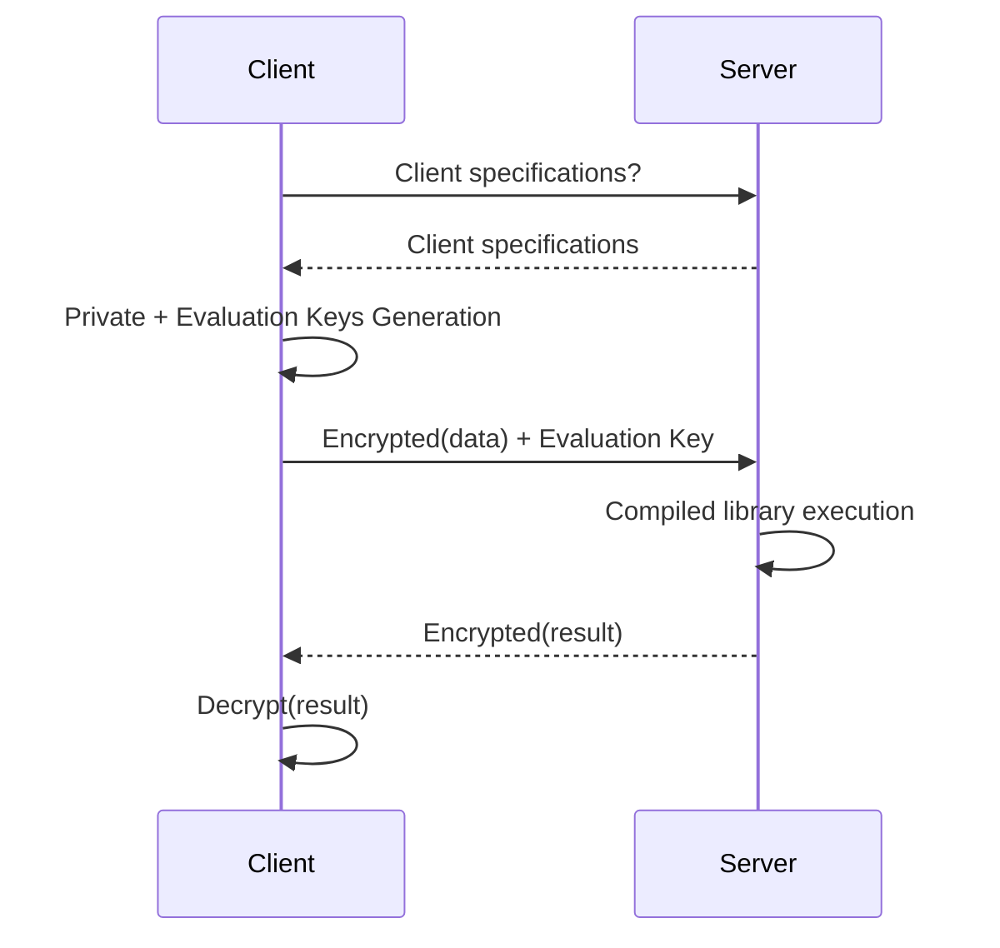

# Deploy
This document explains how to deploy a circuit after the development. After developing your circuit, you may want to deploy it without sharing the circuit's details with every client or hosting computations on dedicated servers. In this scenario, you can use the `Client` and `Server` features of **Concrete**.

## Deployment process

In a typical **Concrete** deployment:

- The server hosts the compilation artifact, including client specifications and the FHE executable.
- The client requests circuit requirements, generates keys, sends an encrypted payload, and receives an encrypted result.




## Example
Follow these steps to deploy your circuit:

1. **Develop the circuit**: You can develop your own circuit using the techniques discussed in previous chapters. Here is an example.

<!--pytest-codeblocks:skip-->
```python
from concrete import fhe

@fhe.compiler({"x": "encrypted"})
def function(x):
    return x + 42

inputset = range(10)
circuit = function.compile(inputset)
```
2. **Save the server files**: Once you have your circuit, save the necessary server files.

<!--pytest-codeblocks:skip-->
```python
circuit.server.save("server.zip")
```

3. **Send the server files**: Send `server.zip` to your computation server.

### Setting up a server

4. **Load the server files**: To set up the server, load the `server.zip` file received from the development machine.


<!--pytest-codeblocks:skip-->
```python
from concrete import fhe

server = fhe.Server.load("server.zip")
```

5. **Prepare for client requests**: The server needs to wait for the requests from clients. 

6. **Serialize `ClientSpecs`**: The requests typically starts with `ClientSpecs` as clients need `ClientSpecs` to generate keys and request computation. 

<!--pytest-codeblocks:skip-->
```python
serialized_client_specs: str = server.client_specs.serialize()
```

7. **Send serialized `ClientSpecs` to clients.**

### Setting up clients

8. **Create the client object**: After receiving the serialized `ClientSpecs` from a server, create the `Client` object.

<!--pytest-codeblocks:skip-->
```python
client_specs = fhe.ClientSpecs.deserialize(serialized_client_specs)
client = fhe.Client(client_specs)
```

### Generating keys (client-side)

9. **Generate keys**: Once you have the `Client` object, perform key generation. This method generates encryption/decryption keys and evaluation keys. 

<!--pytest-codeblocks:skip-->
```python
client.keys.generate()
```


10. **Serialize the evaluation keys**: The server needs access to the evaluation keys. You can serialize your evaluation keys as below.

<!--pytest-codeblocks:skip-->
```python
serialized_evaluation_keys: bytes = client.evaluation_keys.serialize()
```
11. **Send the evaluation keys to the server**.


Serialized evaluation keys are very large, even if they are [compressed](https://docs.zama.ai/concrete/compilation/compression) and can be reused several times: consider caching them on the server


### Encrypting inputs (client-side)

12. **Encrypt inputs**: Encrypt your inputs and request the server to perform some computation. This can be done in the following way.

<!--pytest-codeblocks:skip-->
```python
arg: fhe.Value = client.encrypt(7)
serialized_arg: bytes = arg.serialize()
```

13. **Send the serialized arguments to the server**.

### Performing computation (server-side)

14. **Deserialize received data**: On the server, deserialize the received evaluation keys and arguments received from the client.

<!--pytest-codeblocks:skip-->
```python
deserialized_evaluation_keys = fhe.EvaluationKeys.deserialize(serialized_evaluation_keys)
deserialized_arg = fhe.Value.deserialize(serialized_arg)
```

15. **Run the computation**: Perform the computation and serialize the result.

<!--pytest-codeblocks:skip-->
```python
result: fhe.Value = server.run(deserialized_arg, evaluation_keys=deserialized_evaluation_keys)
serialized_result: bytes = result.serialize()
```

16. **Send the serialized result to the client**: 


Clear arguments can directly be passed to `server.run` (For example, `server.run(x, 10, z, evaluation_keys=...)`).


## Decrypting the result (on the client)

17. **Deserialize the result**: Once you receive the serialized result from the server, deserialize it.

<!--pytest-codeblocks:skip-->
```python
deserialized_result = fhe.Value.deserialize(serialized_result)
```

18. **Decrypt the deserialized result**:

<!--pytest-codeblocks:skip-->
```python
decrypted_result = client.decrypt(deserialized_result)
assert decrypted_result == 49
```

# Deployment of modules

Deploying a [module](../compilation/composing_functions_with_modules.md) follows the same logic as the deployment of circuits. 

For example, consider a module compiled in the following way:

<!--pytest-codeblocks:skip-->
```python
from concrete import fhe

@fhe.module()
class MyModule:
    @fhe.function({"x": "encrypted"})
    def inc(x):
        return x + 1

    @fhe.function({"x": "encrypted"})
    def dec(x):
        return x - 1

inputset = list(range(20))
my_module = MyModule.compile({"inc": inputset, "dec": inputset})
)
```

You can extract the server from the module and save it in a file:

<!--pytest-codeblocks:skip-->
```python
my_module.server.save("server.zip")
```

The only noticeable difference between the deployment of modules and the deployment of circuits is that the methods `Client::encrypt`, `Client::decrypt` and `Server::run` must contain an extra `function_name` argument specifying the name of the targeted function.

For example, to encrypt an argument for the `inc` function of the module:

<!--pytest-codeblocks:skip-->
```python
arg = client.encrypt(7, function_name="inc")
serialized_arg = arg.serialize()
```

To execute the `inc` function:

<!--pytest-codeblocks:skip-->
```python
result = server.run(deserialized_arg, evaluation_keys=deserialized_evaluation_keys, function_name="inc")
serialized_result = result.serialize()
```

To decrypt a result from the execution of `dec`:

<!--pytest-codeblocks:skip-->
```python
decrypted_result = client.decrypt(deserialized_result, function_name="dec")
```
