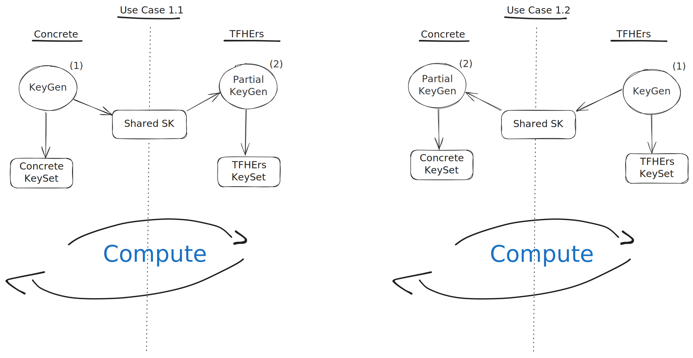

# Scenario 1: Shared secret key

This document explains how to set up a shared secret key between Concrete and TFHE-rs to perform computations.

In this scenario, a shared secret key will be used, while different keysets will be held for Concrete and TFHE-rs. There are two ways to generate keys, outlined with the following steps

#### From Concrete (1.1)

1. Perform a classical key generation in Concrete, which generates a set of secret and public keys.
2. Use this secret key to perform a partial key generation in TFHE-rs, starting from the shared secret key and generating the rest of the necessary keys.

#### From TFHE-rs (1.2)

1. Perform a classical key generation in TFHE-rs, generating a single secret key and corresponding public keys.
2. Use the secret key from TFHE-rs to perform a partial keygen in Concrete.

 While TFHE-rs does use a single secret key, Concrete may generate more than one, but only one of these should be corresponding to the TFHE-rs key. The API does hide this detail, but will often ask you to provide the position of a given input/output. This will be used to infer which secret key should be used. 

After the key generation is complete and we have both keysets, we can perform computations, encryption, and decryption on both ends.



## Setup and configuration

The first step is to define the TFHE-rs ciphertext type that will be used in the computation (see [Overview](./README.md)). This includes specifying both cryptographic and encoding parameters. TFHE-rs provides a pre-computed list of recommended parameters, which we will use to avoid manual selection. You can find the parameters used in this guide [here](https://github.com/zama-ai/tfhe-rs/blob/2bd9f7aab412c92d0642a35fa87d1d0f4e2193b9/tfhe/src/shortint/parameters/classic/gaussian/p_fail_2_minus_64/ks_pbs.rs#L255).

In short, we first determine a suitable set of parameters from TFHE-rs and then apply them in Concrete. This ensures that the ciphertexts generated in both systems will be compatible by using the same cryptographic parameters.

```python
from functools import partial
from concrete.fhe import tfhers

# This will create a TFHE-rs unsigned integer of 8 bits
# using the parameters from the json file
tfhers_type = tfhers.get_type_from_params(
    # The json file is a serialization of ClassicPBSParameters in TFHE-rs
    "tfhers_params.json",
    is_signed=False,
    precision=8,
)

# this partial will help us create TFHERSInteger with the given type instead of calling
# tfhers.TFHERSInteger(tfhers_type, value) every time
tfhers_int = partial(tfhers.TFHERSInteger, tfhers_type)
```

## Defining the circuit and compiling

We will now define a simple modular addition function. This function takes TFHE-rs inputs, converts them to Concrete format (`to_native`), runs a computation, and then converts them back to TFHE-rs. The circuit below is a common example that takes and produces TFHE-rs ciphertexts. However, there are other scenarios where you might not convert back to TFHE-rs, or you might convert to a different type than the input. Another possibility is to take one native ciphertext and one TFHE-rs ciphertext.

```python
def compute(tfhers_x, tfhers_y):
    ####### TFHE-rs to Concrete #########

    # x and y are supposed to be TFHE-rs values.
    # to_native will use type information from x and y to do
    # a correct conversion from TFHE-rs to Concrete
    concrete_x = tfhers.to_native(tfhers_x)
    concrete_y = tfhers.to_native(tfhers_y)
    ####### TFHE-rs to Concrete #########

    ####### Concrete Computation ########
    concrete_res = (concrete_x + concrete_y) % 213
    ####### Concrete Computation ########

    ####### Concrete to TFHE-rs #########
    tfhers_res = tfhers.from_native(
        concrete_res, tfhers_type
    )  # we have to specify the type we want to convert to
    ####### Concrete to TFHE-rs #########
    return tfhers_res
```

We can compile the circuit as usual.

```python
compiler = fhe.Compiler(compute, {"tfhers_x": "encrypted", "tfhers_y": "encrypted"})
inputset = [(tfhers_int(120), tfhers_int(120))]
circuit = compiler.compile(inputset)
```

You could optionally try the full execution in Concrete

```python
# encode/encrypt
encrypted_x, encrypted_y = circuit.encrypt(tfhers_type.encode(7), tfhers_type.encode(9))
# run
encrypted_result = circuit.run(encrypted_x, encrypted_y)
# decrypt
result = circuit.decrypt(encrypted_result)
# decode
decoded = tfhers_type.decode(result)
```

## Connecting Concrete and TFHE-rs

We are going to create a TFHE-rs bridge that facilitates the seamless transfer of ciphertexts and keys between Concrete and TFHE-rs.

```python
tfhers_bridge = tfhers.new_bridge(circuit)
```

## Key generation

In order to establish a shared secret key between Concrete and TFHE-rs, there are two possible methods for key generation. The first method (use case 1.1) involves generating the Concrete keyset first and then using the shared secret key in TFHE-rs to partially generate the TFHE-rs keyset. The second method (use case 1.2) involves doing the opposite. You should only run one of the two following methods.

 Remember that one key generation need to be a partial keygen, to be sure that there is a unique and common secret key. 

 Parameters used in TFHE-rs must be the same as the ones used in Concrete. 

### KeyGen starts in Concrete (use case 1.1)

First, we generate the Concrete keyset and then serialize the shared secret key that will be used to encrypt the inputs. In our case, this shared secret key is the same for all inputs and outputs.

```python
# generate all keys from scratch (not using initial secret keys)
circuit.keygen()
# since both inputs have the same type, they will use the same secret key, thus we serialize it once
secret_key: bytes = tfhers_bridge.serialize_input_secret_key(input_idx=0)
# we write it to a file to be used by TFHE-rs
with open("secret_key_from_concrete", "wb") as f:
    f.write(secret_key)
```

Next, we generate client and server keys in TFHE-rs using the shared secret key from Concrete. We will cover serialization in a [later section](./serialization.md), so there's no need to worry about how we loaded the secret key. For now, we will consider having 4 functions (`save_lwe_sk`, `save_fheuint8`, `load_lwe_sk`, `load_fheuint8`) which respectively save/load an LWE secret key and an FheUint8 to/from a given path.

```rust
use tfhe::core_crypto::prelude::LweSecretKey;
use tfhe::ClientKey;

/// ...

let lwe_sk: LweSecretKey<Vec<u64>> = load_lwe_sk("secret_key_from_concrete");
let shortint_key =
    tfhe::shortint::ClientKey::try_from_lwe_encryption_key(
        lwe_sk,
        // Concrete uses this parameters to define the TFHE-rs ciphertext type
        tfhe::shortint::prelude::PARAM_MESSAGE_2_CARRY_3_KS_PBS
    ).unwrap();
let client_key = ClientKey::from_raw_parts(shortint_key.into(), None, None, tfhe::Tag::default());
let server_key = client_key.generate_server_key();
```

### KeyGen starts in TFHE-rs (use case 1.2)

First, we generate the TFHE-rs keyset and then serialize the shared secret key that will be used to encrypt the inputs

```rust
use tfhe::{prelude::*, ConfigBuilder};
use tfhe::generate_keys;

/// ...

// Concrete uses this parameters to define the TFHE-rs ciphertext type
let config = ConfigBuilder::with_custom_parameters(
        tfhe::shortint::prelude::PARAM_MESSAGE_2_CARRY_3_KS_PBS,
    )
.build();

let (client_key, server_key) = generate_keys(config);
let (integer_ck, _, _, _) = client_key.clone().into_raw_parts();
let shortint_ck = integer_ck.into_raw_parts();
let (glwe_secret_key, _, _) = shortint_ck.into_raw_parts();
let lwe_secret_key = glwe_secret_key.into_lwe_secret_key();

save_lwe_sk(lwe_secret_key, "secret_key_from_tfhers");
```

Next, we generate a Concrete keyset using the shared secret key from TFHE-rs.

```python
# this was generated from TFHE-rs
with open("secret_key_from_tfhers", "rb") as f:
    sk_buff = f.read()
# maps input indices to their secret key
input_idx_to_key = {0: sk_buff, 1: sk_buff}
# we do a Concrete keygen starting with an initial set of secret keys
tfhers_bridge.keygen_with_initial_keys(input_idx_to_key_buffer=input_idx_to_key)
```

## Using ciphertexts

At this point, we have everything necessary to encrypt, compute, and decrypt on both Concrete and TFHE-rs. Whether you began key generation in Concrete or in TFHE-rs, the keysets on both sides are compatible.

Now, we'll walk through an encryption and computation process in TFHE-rs, transition to Concrete to run the circuit, and then return to TFHE-rs for decryption.

First, we do encryption and a simple addition in TFHE-rs. For more information on how to save ciphertexts, refer to [Serialization](./serialization.md).

```rust
let x = FheUint8::encrypt(162, &client_key);
let y = FheUint8::encrypt(73, &client_key);
// we will add two encrypted integers in TFHE-rs to showcase
// that we are doing some part of the computation in TFHE-rs
// and the rest in Concrete
let z = FheUint8::encrypt(9, &client_key);
y += z;

save_fheuint8(x, "tfhers_x");
save_fheuint8(y, "tfhers_y");
```

Next, we can load these ciphertexts in Concrete and then run our compiled circuit as usual.

```python
with open("tfhers_x", "rb") as f:
    buff_x = f.read()
with open("tfhers_y", "rb") as f:
    buff_y = f.read()
tfhers_uint8_x = tfhers_bridge.import_value(buff_x, input_idx=0)
tfhers_uint8_y = tfhers_bridge.import_value(buff_y, input_idx=1)

encrypted_result = circuit.run(tfhers_uint8_x, tfhers_uint8_y)
```

Finally, we can decrypt and decode in Concrete

```python
result = circuit.decrypt(encrypted_result)
decoded = tfhers_type.decode(result)

assert decoded == (162 + 73 + 9) % 213
```

... or export it to TFHE-rs for computation/decryption

```python
buff_out = tfhers_bridge.export_value(encrypted_result, output_idx=0)
# write it to file
with open("tfhers_out", "wb") as f:
    f.write(buff_out)
```

```rust
let fheuint = load_fheuint8("tfhers_out");
// you can do computation before decryption as well
let result: u8 = fheuint.decrypt(&client_key);

assert!(result == (162 + 73 + 9) % 213)
```

Full working example can be found [here](../../../frontends/concrete-python/examples/tfhers/).
