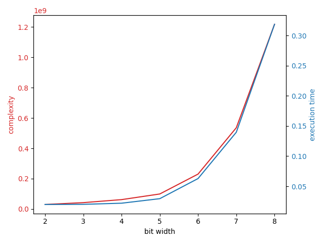

## Optimize table lookups

This guide teaches how costly table lookups are, and how to optimize them to improve the execution time of Concrete circuits.

The most costly operation in Concrete is the table lookup operation, so one of the primary goals of optimizing performance is to reduce the amount of table lookups.

Furthermore, the bit width of the input of the table lookup plays a major role in performance.

```python
import time

import numpy as np
import matplotlib.pyplot as plt
from concrete import fhe

def f(x):
    return x // 2

bit_widths = list(range(2, 9))
complexities = []
timings = []

for bit_width in bit_widths:
    inputset = fhe.inputset(lambda _: np.random.randint(0, 2 ** bit_width))

    compiler = fhe.Compiler(f, {"x": "encrypted"})
    circuit = compiler.compile(inputset)

    circuit.keygen()
    for sample in inputset[:3]:  # warmup
        circuit.encrypt_run_decrypt(*sample)

    current_timings = []
    for sample in inputset[3:13]:
        start = time.time()
        result = circuit.encrypt_run_decrypt(*sample)
        end = time.time()

        assert np.array_equal(result, f(*sample))
        current_timings.append(end - start)

    complexities.append(int(circuit.complexity))
    timings.append(float(np.mean(current_timings)))

    print(f"{bit_width} bits -> {complexities[-1]:>13_} complexity -> {timings[-1]:.06f}s")

figure, complexity_axis = plt.subplots()

color = "tab:red"
complexity_axis.set_xlabel("bit width")
complexity_axis.set_ylabel("complexity", color=color)
complexity_axis.plot(bit_widths, complexities, color=color)
complexity_axis.tick_params(axis="y", labelcolor=color)

timing_axis = complexity_axis.twinx()

color = 'tab:blue'
timing_axis.set_ylabel('execution time', color=color)
timing_axis.plot(bit_widths, timings, color=color)
timing_axis.tick_params(axis='y', labelcolor=color)

figure.tight_layout()
plt.show()
```

The code above prints:
```
2 bits ->    29_944_416 complexity -> 0.019826s
3 bits ->    42_154_798 complexity -> 0.020093s
4 bits ->    61_979_934 complexity -> 0.021961s
5 bits ->    99_198_195 complexity -> 0.029475s
6 bits ->   230_210_706 complexity -> 0.062841s
7 bits ->   535_706_740 complexity -> 0.139669s
8 bits -> 1_217_510_420 complexity -> 0.318838s
```

And displays:

