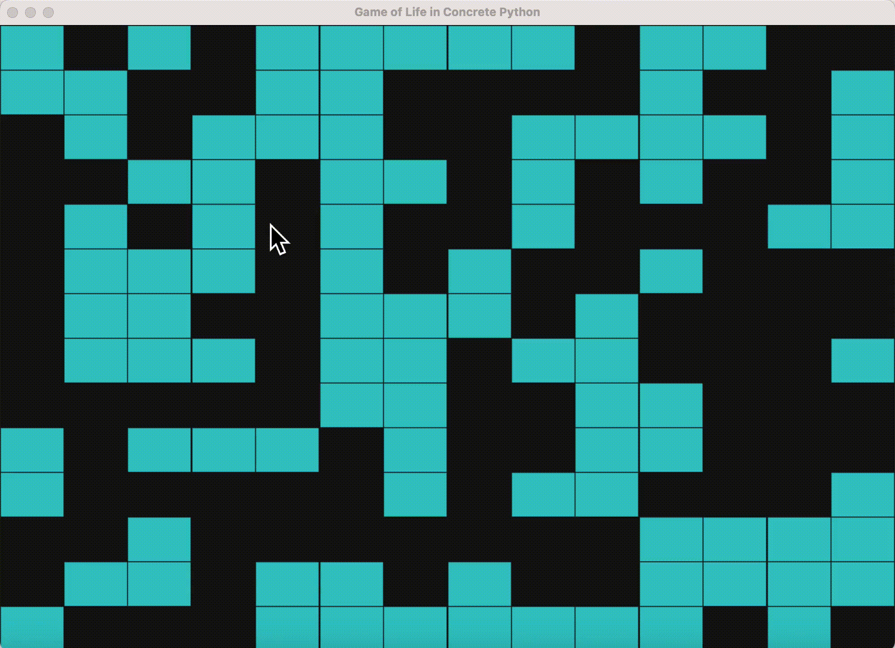

# Game of life

In the associated [Python file](game_of_life.py), you can run the Game of Life, written in Concrete Python.



### Installation

In addition to Concrete, you must install `pygame` in your virtual environment:

- `pip3 install pygame`

Once done, if you go to `frontends/concrete-python/examples/game_of_life`, `python game_of_life.py --help` should give you the manpage:

```
Game of Life in Concrete Python.

options:
  -h, --help            show this help message and exit
  --dimension DIMENSION
                        Dimension of the grid
  --refresh_every REFRESH_EVERY
                        Refresh the grid every X steps
  --method {method_3b,method_4b,method_5b,method_basic}
                        Method for refreshing the grid
  --log2_global_p_error LOG2_GLOBAL_P_ERROR
                        Probability of correctness issue (full circuit)
  --log2_p_error LOG2_P_ERROR
                        Probability of correctness issue (individual TLU)
  --simulate            Simulate instead of running computations in FHE
  --show_mlir           Show the MLIR
  --stop_after_compilation
                        Stop after compilation
  --text_output         Print a text output of the grid
```

### Running

Then, you can play with the different options, and in particular:

- `dimension`, to chose the size of the grid; the larger, the slower
- `method`, to chose which implementation is used for the grid update
- `log2_global_p_error` and `log2_p_error`, to chose the probability of correctness (see the Concrete documentation for more information)
- `simulate`, to do computations only in simulation, i.e., not in FHE

### Typical Executions

In simulation: `python3 game_of_life.py --dimension 100 --refresh_every 50 --simulate`

In FHE: `python3 game_of_life.py --dimension 6 --refresh_every 8 --log2_p_error -40 --method method_4b`

### Technical Explanations

See the full explanations in [this blog post](https://www.zama.ai/post/the-encrypted-game-of-life-using-concrete-python)https://www.zama.ai/post/the-encrypted-game-of-life-using-concrete-python. 
